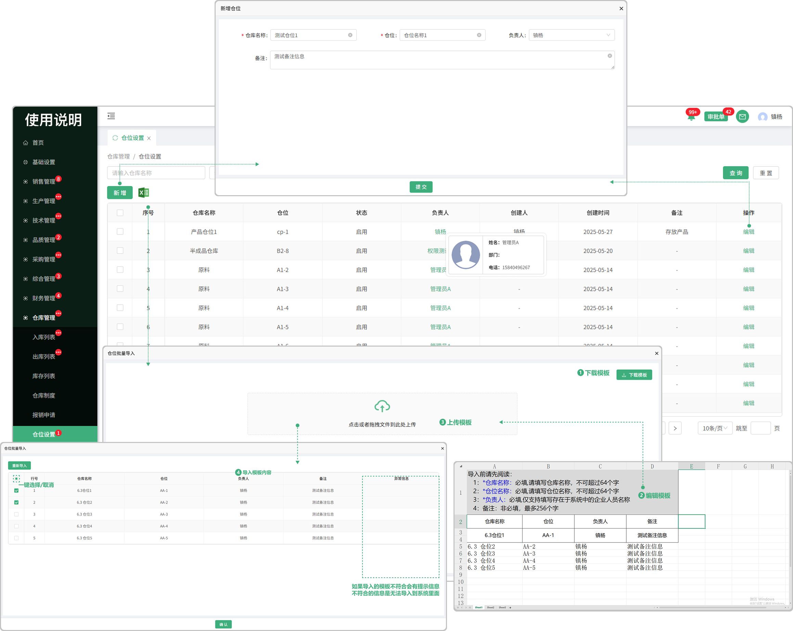

# 仓位设置

> "仓位设置"位仓库管理板块，在仓位列表中可以新增仓位，支持保存草稿、编辑、（在库存列表中可选用放置所建的仓位）

#### 1.新增仓位

* 点击新增按钮输入仓库名称，仓位，负责人，备注信息等，可去添加新的仓位

#### 2.编辑功能

* 在原有新增的仓位上编辑仓位信息（更改原有基础上的信息）

#### 3. 批量导入

* 点击批量导入可下载导入模板

* 先下载模板，所下载的模板只用于仓位列表中导入所上传的模板

* 在模板中编辑需导入的信息（编辑之前先看模板上方的导入规格，避免导入的信息出现错误）

* 如果导入的信息不能添加到系统中，请查看后面备注的异常信息，可选择重新导入

