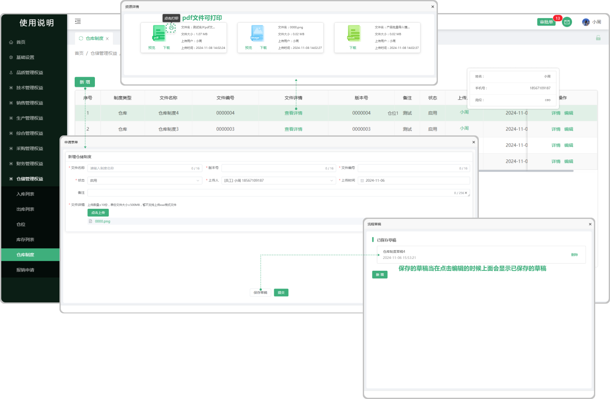

#  仓库制度123123

> "仓库制度“位于仓储管理板块，在"仓库制度列表"中新增相对应的"制度",是仓储板块维护而指定的制度

#### 1. 如图所示：
* 新增：点击新增可以在界面中添加仓库制度
* 草稿：保存草稿以后在点击新增的时候会显示之前所保留的草稿
* 文件详情：点击文件详情相对应下面的 "查看文件" 可以查看到当时新增制度时上传的文件信息 (支持下载)
* 上传人：点击上传人下面对应的人员可查看相应人员的基本信息

