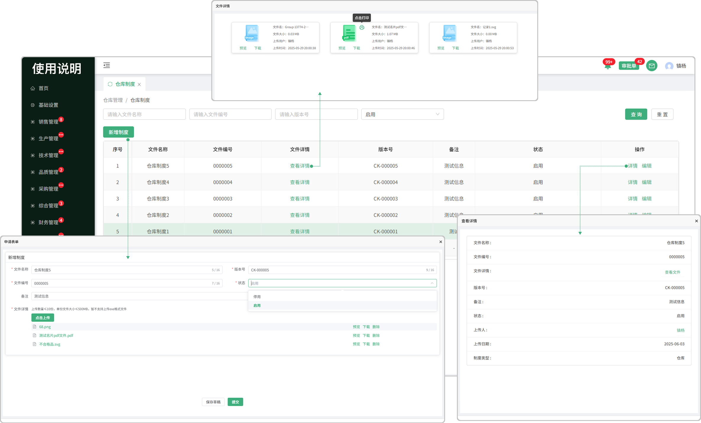

#  仓库制度

> "仓库制度“位于仓储管理板块，在"仓库制度列表"中新增相对应的"制度",是仓储板块维护而指定的制度

#### 1. 新增制度

* 输入文件名称，版本号，文件编号，备注信息，选择状态（启用/停用）

* 可上传多个文件

#### 2.保存草稿功能、

* 可存为草稿，再次打开新增时显示之前所存的草稿

#### 3.文件详情

* 新增制度时上传的文件，点击可查看全部（支持下载、打印）

#### 5.编辑功能

* 可在原有新增的制度上进行修改（可保存草稿箱）

#### 6.详情

* 点击详情可查看文件名称，文件编号，文件详情，版本号，备注信息，状态，上传人，上传日期，制度类型

