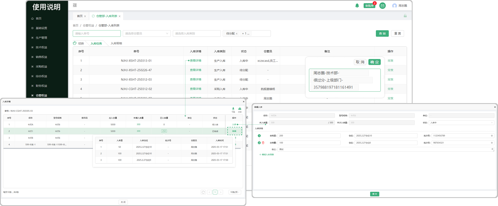

# 入库列表

> "入库列表“位于仓储管理板块
> 
> 1.采购管理的 ”缺料列表“ 中收货以后带入过来的，包含产品、零件，在入库列表中需要去分发、入库。
>
> 2.成品检验、入厂检验、过程检验、中员工检验完成

#### 1. 如图所示：
* 分发：点击分发选择分发的人员（指定分发给某人）
* 入库：点击入库填写入库备注（非必填）
* 产品 / 零件：指的是入库的产品或者零件，点击相对应的产品 / 零件可产看基本信息

