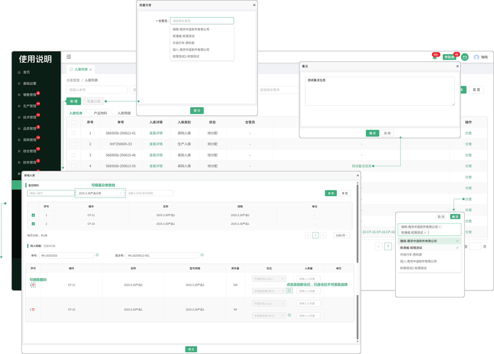
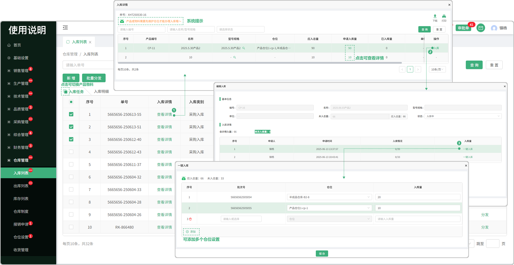
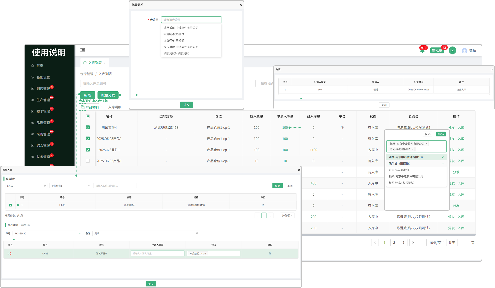
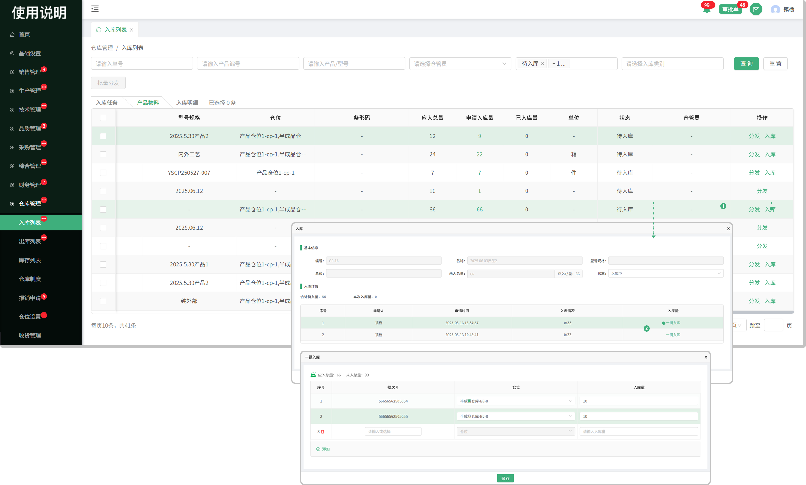
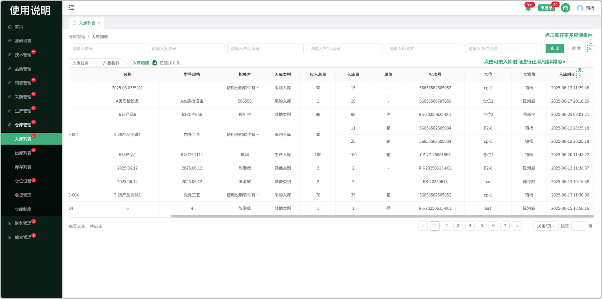

# 入库列表

> "入库列表“位于仓储管理板块
> 
> 1.采购管理的 ”缺料列表“ 中收货以后带入过来的，包含产品，物料，在入库列表中需要去分发、入库。
>
> 2.成品检验、入厂检验、过程检验、中员工检验完成

## 入库任务
* 点击入库任务前的切换按钮可切换到“产品物料”页面

#### 1. 新增

* 点击新增按钮，输入编号/分类/名称/型号规格等查询条件
* 查询到库存中有这个产品/物料将显示出来，没有则不显示，停用的产品/物料也可以查询到
* 勾选序号前的勾选框，会带入到下方待入明细中

  -可在对应的仓位中添加新仓位，可添加多个仓位，已选仓位不可重复选择

  -点击红色垃圾桶图标可删除这条信息

#### 2.批量分发

* 勾选页面序号前的勾选框触发批量分发按钮
* 点击按钮可将所选信息分配给指定人员（可分配给多个人员来完成）

#### 3.分发

* 点击分发按钮可将分配给指定人员（可分配多个人员来完成）

#### 4.备注

* 可输入备注信息

#### 5.入库详情

* 点击入库详情可查看入库数据，支持下载/打印
* 点击入库按钮，在入库详情下方可选择一键入库

  -选择仓位填写入库量

  -可添加多个仓位设置，点击红色删除图标可删除

  -点击保存按钮，完成后编辑入库页面显示入库量

## 产品物料

* 点击产品物料前的切换按钮可切换到“入库任务”页面

#### 1. 新增

* 点击新增按钮，输入编号/分类/名称/型号规格等查询条件
* 查询到库存中有这个产品/物料的信息将显示出来，没有则不显示
* 勾选序号前的勾选框，会带入到下方待入明细中

  -点击红色垃圾桶图标可删除这条信息

  -输入申请入库量和仓位即可完成

#### 2.批量分发

* 勾选页面序号前的勾选框触发批量分发按钮
* 点击按钮可将所选信息分配给指定人员（可分配给多个人员来完成）

#### 3.分发

* 点击分发按钮可将分配给指定人员（可分配多个人员来完成）

#### 4.申请入库量

* 点击可查看申请入库的数量，申请人，申请时间，备注信息

#### 5.已入库量

* 点击可查看，已入库的数量，仓位，批次号，仓管员，入库时间

#### 6.入库

* 点击入库按钮，在入库详情下方可选择一键入库

  -选择仓位填写入库量

  -可添加多个仓位设置，点击红色删除图标可删除

  -点击保存按钮，完成后编辑入库页面显示入库量

## 入库明细

* 可在此页面查看采购/生产入库的明细记录

