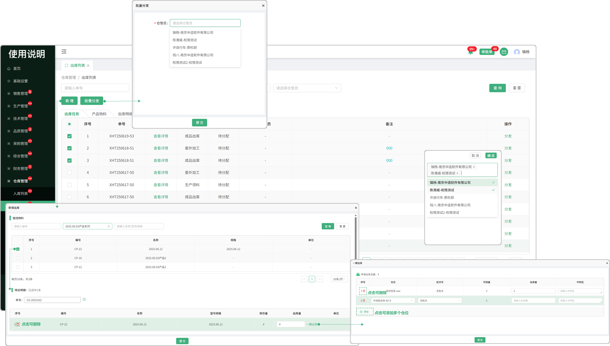
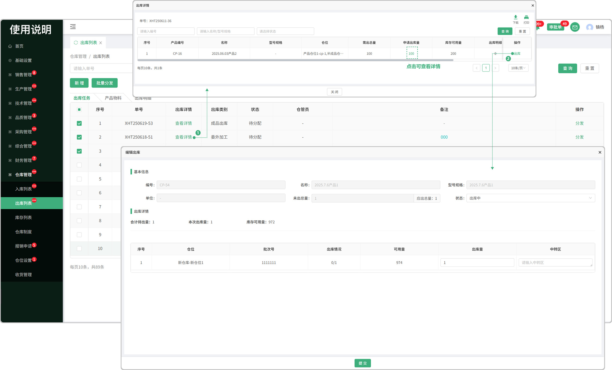
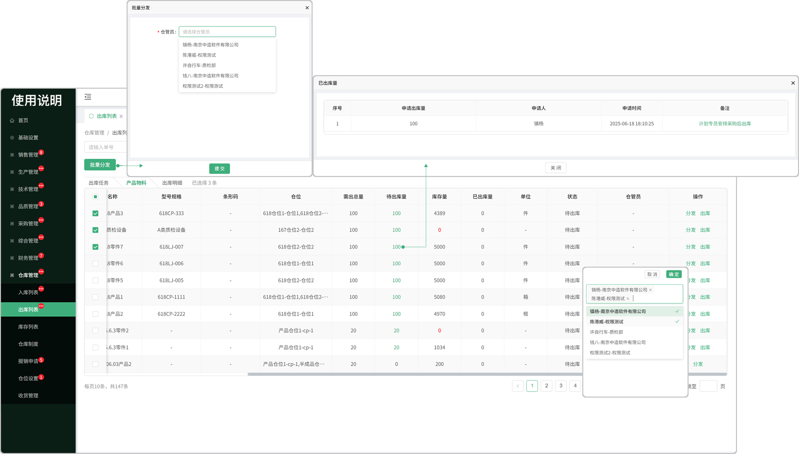
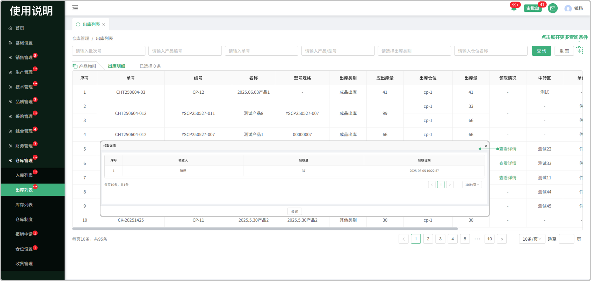

# 出库任务

> "出库列表“ 位于仓储管理板块，是从调度任务带过来的数据，在调度任务中去安排产品/零件以后会带入到出库列表中，进行分发、出库

## 出库任务
* 点击出库任务前的切换按钮可切换到“产品物料”页面

#### 1. 新增

* 点击新增按钮，输入编号/分类/名称/型号规格等查询条件
* 查询到库存中有这个产品/物料的信息将显示出来，没有则不显示
* 勾选序号前的勾选框，会带入到下方待入明细中

  -点击红色垃圾桶图标可删除这条信息

  -输入出库量显示一键出库按钮，点击按钮打开弹窗可编辑一键出库

#### 2.批量分发

* 勾选页面序号前的勾选框触发批量分发按钮
* 点击按钮可将所选信息分配给指定人员（可分配给多个人员来完成）

#### 3.分发

* 点击分发按钮可将分配给指定人员（可分配多个人员来完成）

 

#### 4.出库详情

* 点击出库详情可查看出库数据，支持下载/打印
* 点击出库按钮，显示基本信息和出库详情

  -点击一键出库按钮打开弹窗输入出库量，中转区

  -点击红色垃圾桶图标可删除这条信息，支持添加多个仓位

  -点击保存按钮，完成后编辑出库页面显示出库量

## 产品物料

* 点击产品物料前的切换按钮可切换到“出库任务”页面

#### 1. 新增

* 点击新增按钮，输入编号/分类/名称/型号规格等查询条件
* 查询到库存中有这个产品/物料的信息将显示出来，没有则不显示
* 勾选序号前的勾选框，会带入到下方待出明细中

  -点击红色垃圾桶图标可删除这条信息

  -输入出库量显示一键出库按钮，点击按钮打开弹窗可编辑一键出库

#### 2.批量分发

* 勾选页面序号前的勾选框触发批量分发按钮
* 点击按钮可将所选信息分配给指定人员（可分配给多个人员来完成）

#### 3.分发

* 点击分发按钮可将分配给指定人员（可分配多个人员来完成）

#### 4.待出库量

* 点击可查看申请出库的数量，申请人，申请时间，备注信息

#### 5.已出库量

* 点击可查看，申请出库的数量，已出库的数量，出库仓位，批次号，中转区，仓管员，出库时间

#### 6.出库

* 点击出库按钮，显示基本信息和出库详情

  -点击一键出库按钮打开弹窗输入出库量，中转区

  -点击红色垃圾桶图标可删除这条信息，支持添加多个仓位

  -点击保存按钮，完成后编辑出库页面显示出库量

## 出库明细

#### 1.出库明细

* 在出库任务页面进行出库的产品/物料会产生记录带到出库明细页面

#### 2.领取情况

* 点击领取情况可查看领取人、领取量、领取时间

  -在生产员工页面开始生产时所领取的物料会显示在领料情况里面

