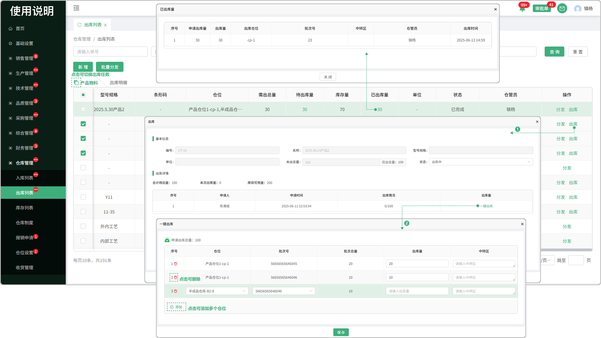

# 出库任务

> "出库列表“ 位于仓储管理板块，是从调度任务带过来的数据，在调度任务中去安排产品/零件以后会带入到出库列表中，进行分发、出库

## 出库任务
* 默认出库界面展示“出库任务”页面，也可点击出库任务菜单栏进入

#### 1. 新增

* 点击新增按钮，输入编号/分类/名称/型号规格等查询条件
* 查询到库存中有这个产品/物料的信息将显示出来，没有则不显示
* 勾选序号前的勾选框，会带入到下方待入明细中
* 完成后可点击“一键出库”完成新增出库任务

  -点击红色垃圾桶图标可删除这条信息

#### 2. 订单交期

* 点击后可查看订单交期详情、物料明细、生产进度详情以及任务明细
* 可以通过任务明细中生产进度查看对应编号的进度详情

#### 3. 生产进度

* 点击后可查看订单交期详情、物料明细、生产进度详情以及任务明细
* 可以通过任务明细中生产进度查看对应编号的进度详情

#### 4.出库

* 点击出库详情可查看出库数据，支持下载/打印
* 点击出库按钮，显示基本信息和出库详情

  -输入出库量，点击提交完成出库

#### 5.出库

* 点击出库按钮，显示出库信息

  -可选择不同维度（产品、装配物料、外发物料）查看出库信息
  -可勾选相关物料进行一键出库

#### 6.申请出库量

* 点击申请出库量数字可查看详情信息

#### 7.下载/打印

* 点击下载/打印可下载/打印“生产物料出库列表"

#### 8.出库详情

* 点击出库按钮，显示基本信息和出库详情

  -输入出库量，点击提交完成出库
  -可通过“添加仓位”从其他仓库出当前物料

## 出库明细

#### 1.出库明细

* 在出库任务页面进行出库的产品/物料会产生记录带到出库明细页面

#### 2.导出

* 点击“导出”可导出选中数据

