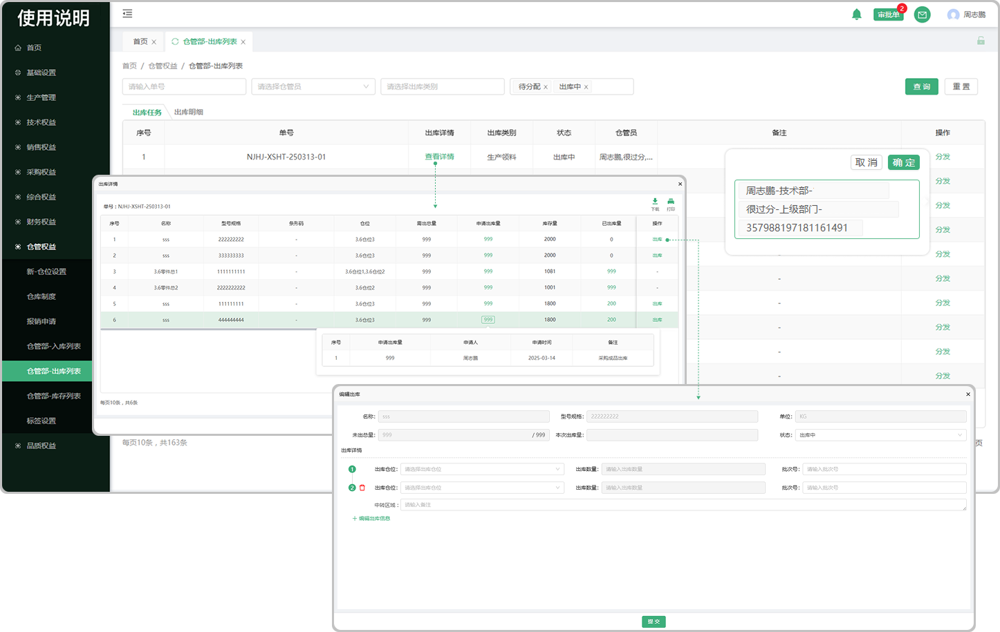

# 出库任务

> "出库列表“ 位于仓储管理板块，是从调度任务带过来的数据，在调度任务中去安排产品 / 零件以后会带入到出库列表中，进行分发、出库

#### 1.分发
* 点击分发选择分发的人员（可指定多个人），分发完成界面的 出库人员下面，会显示对应分发的人员

#### 2.出库详情

* 支持下载、打印功能
* 点击出库详情页面所对应的查看详情可安排出库（先设置分发人员），没有库存的零件/产品无法出库
* 点击出库按钮，选择出库状态、仓位、出库数量、输入批次号

  -可编辑出库信息（可增加出库仓位选择出库）

#### 3.出库类别

* 生产领料：在调度时走生产路线所带入的产品/零件

* 成品出库：在调度时走使用库存的产品/零件

#### 4.分发

* 点击分发在选择框中选择所分发的仓库员（支持选择多个仓管员）

# 出库明细

#### 1.出库明细

* 在出库任务页面进行出库的产品/零件会产生记录带到出库明细页面

#### 2.领取情况

* 点击领取情况可查看领取人、领取量、领取时间

  -在生产员工页面开始生产时所领取的物料会显示在领料情况里面

