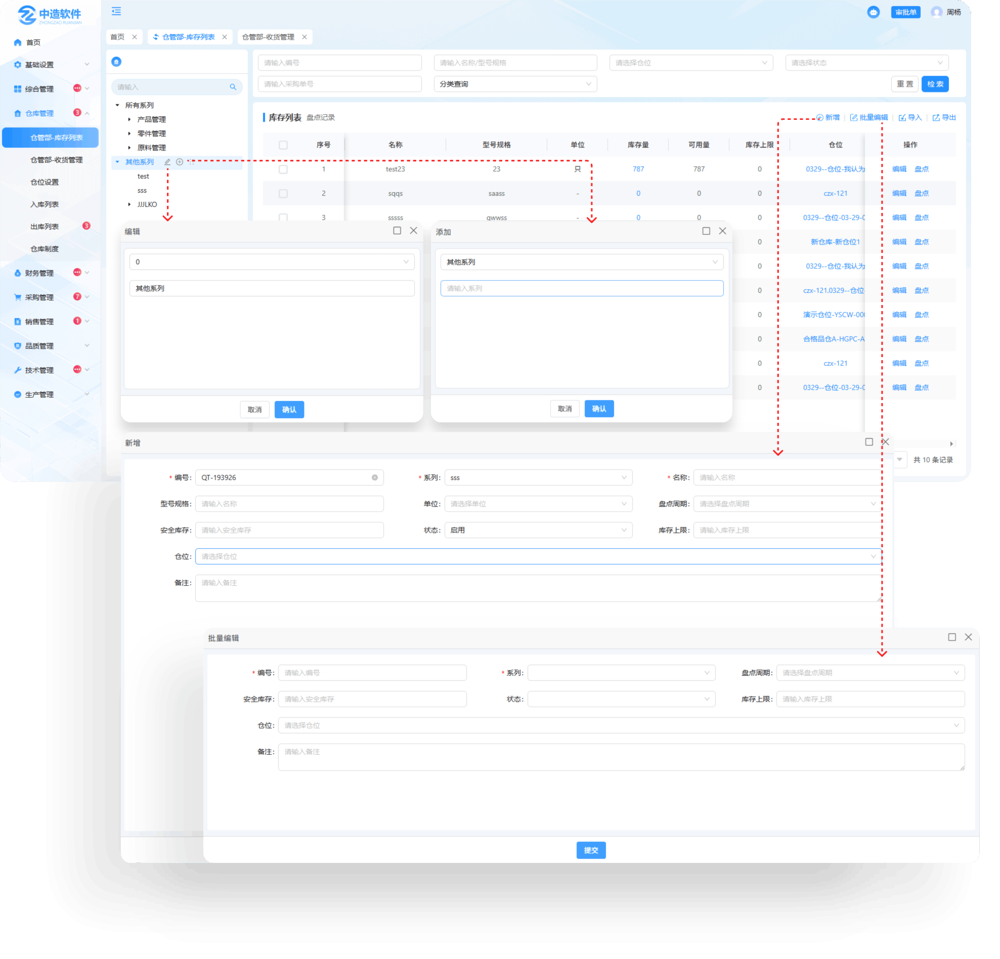
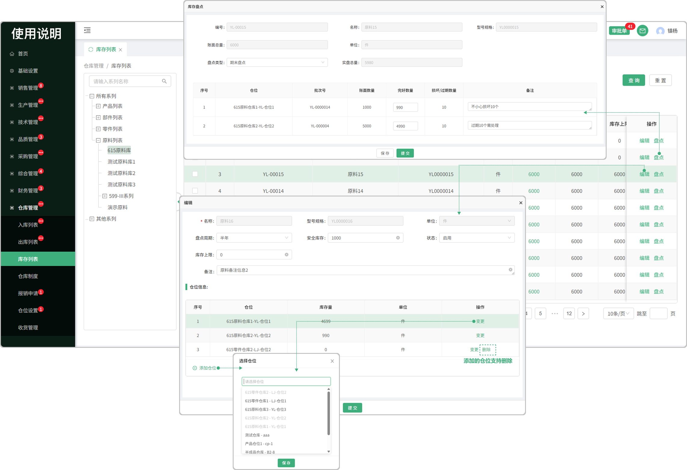
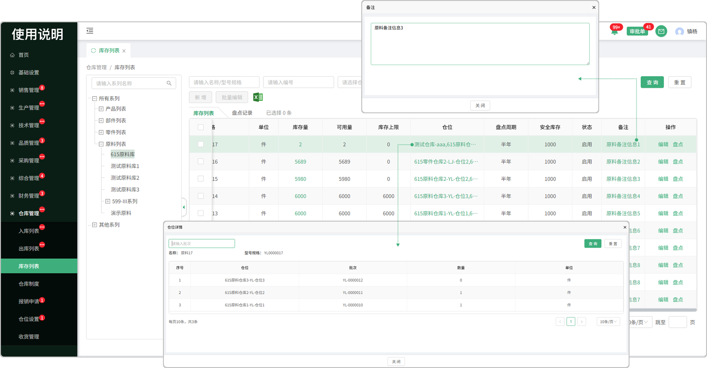
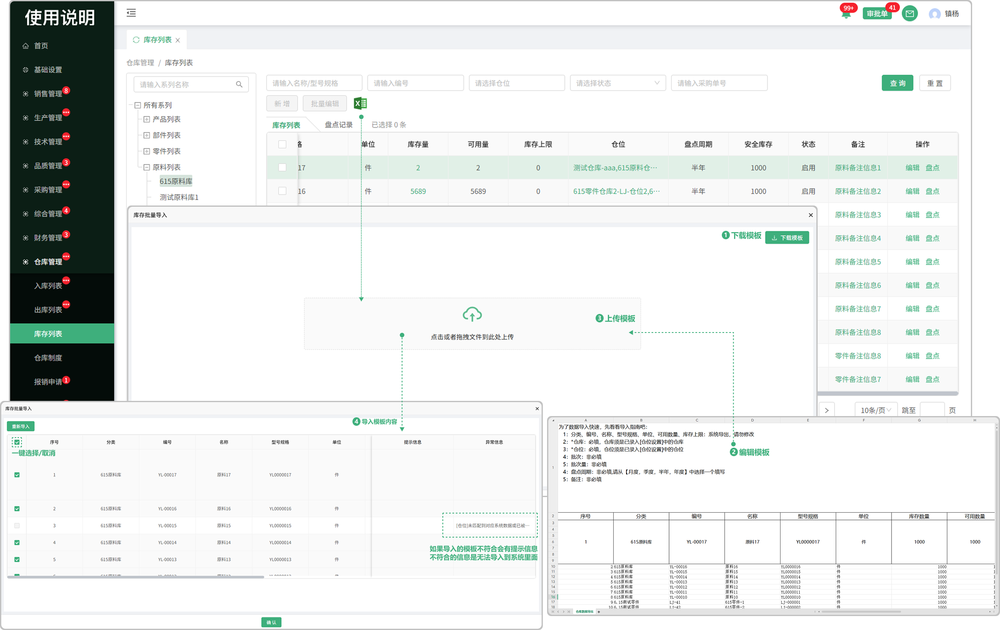
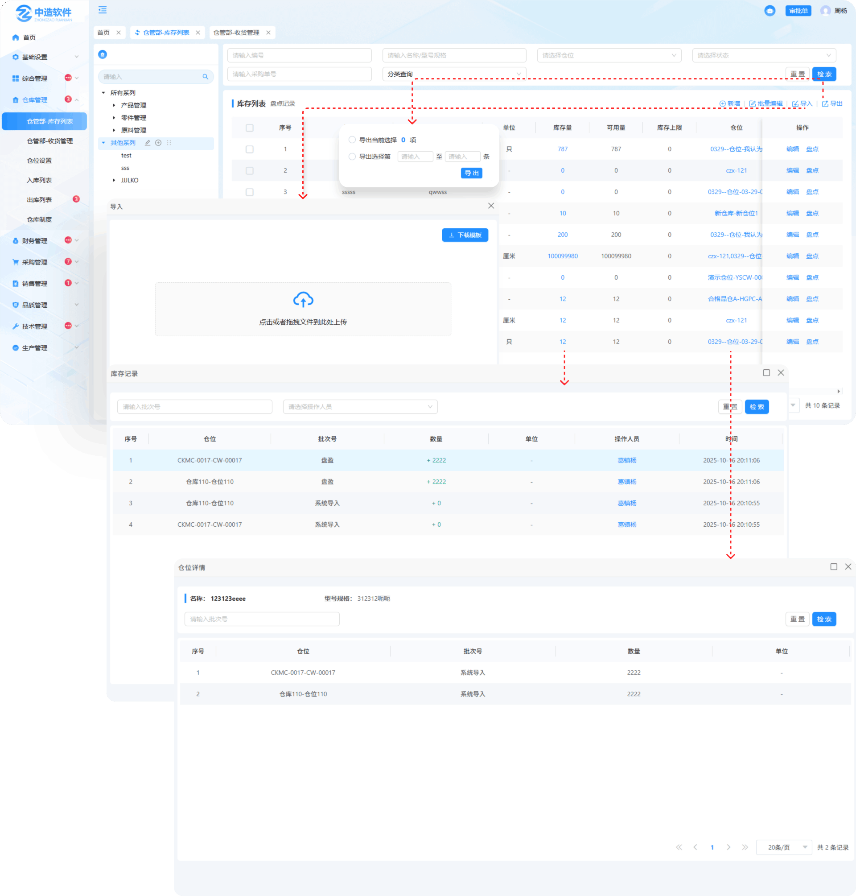
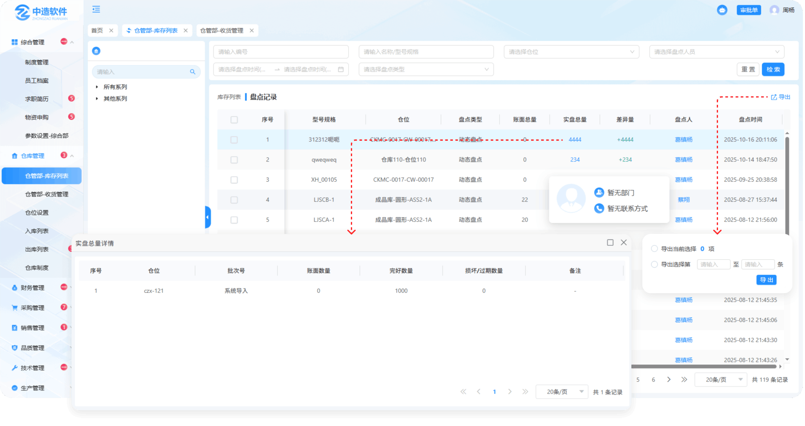

# 库存列表

> "入库列表“位于仓储管理板块，是从仓储管理的 ”入库列表“ 中入库以后流转到库存列表中的信息

#### 1.系列分类

* 在所有系列中，双击可编辑系列的名称

* 在其他系列中，可新增系列，双击编辑系列名称，新增的系列支持添加，删除

#### 2. 批量编辑

* 勾选需要编辑的产品可批量编辑它的盘点周期，安全库存，状态，库存上限，仓位，备注

#### 3.库存量

* 点击可查看盘点的详细记录

#### 4.编辑

* 点击编辑按钮可选择盘点周期，可输入安全库存，选择启用/停用状态，输入库存上限

  -列：如果输入库存上限是100，当采购时超出了库存上限100，将提示:采购后将超过库存上限，是否继续的提示语

* 可添加仓位，变更仓位，添加的仓位支持删除

#### 5.盘点

* 选择盘点类型，在对应的仓位中，输入 完好数量，准备信息，系统会根据账面数量自动算出损坏或过期的数量

#### 6.仓位

* 点击可查看这个产品所对应的所有仓位信息，支持批次查询

#### 7.备注

* 点击备注下的信息可查看备注的完整信息

#### 8.批量导入

* 点击批量导入，先下载模板（注意下载的模板只适用于批量导入库存列表里面上传的模板)
* 点开下载的模板进行编辑（编辑时请阅读表格上面的提示文案，以防导入时出现错误，从而无法导入）

* 点击或者拖拽所保存的模板（只有在库存列表的批量导入中下载的模板才能上传，其他无效）进行上传
* 上传成功会弹出显示上传的数据，可选择性导入或者一键导入（如果无法导入，请滑动到页面最后，查看提示信息，可能存在编辑时出现的错误，需从新更改再次上传）、

#### 9.导出

* 点击导出按键，出现导出弹窗，可在输入框中输入需导出数据数量，点击导出后，页面出现“数据导出中”提示弹窗，当导出任务结束时，可在本地查看导出文件

# 盘点记录

#### 1导出

* 点击批量导出按钮可将库存列表里面的产品/部件等导出来

  -可一键选择导出或手动输入n条进行导出 

#### 2.实盘总量

可查看实盘总量的详情包括仓位，批次号，账面数量，完好数量，损坏/过期数量，备注信息

#### 3.盘点人

* 鼠标悬浮在盘点人员上面可查看人员的基本信息（姓名，部门，电话）

#### 4.重置

* 点击重置按键后，左侧树也将重置

#### DOUAHFG

