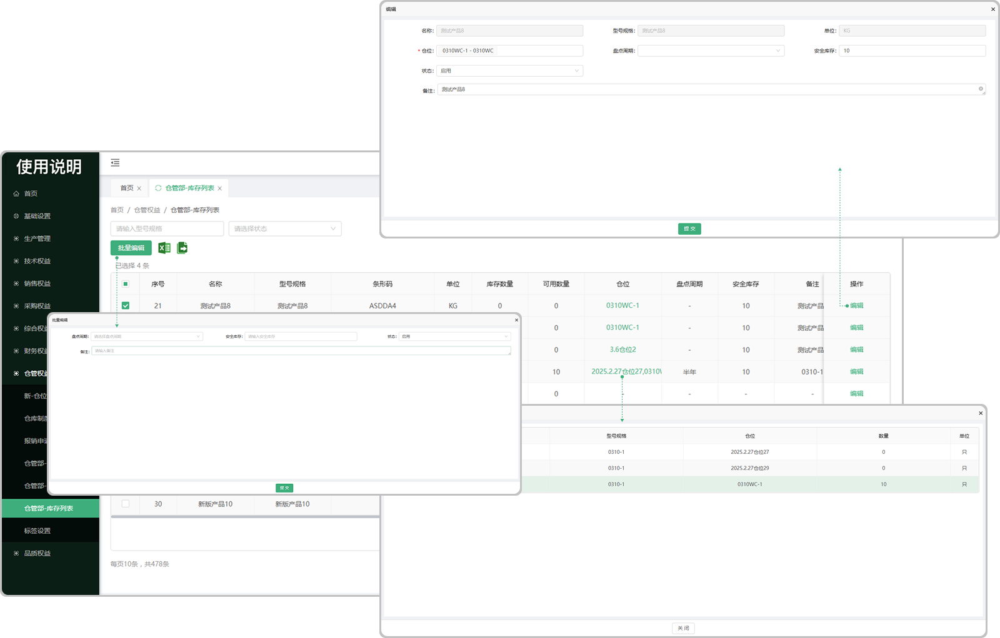

# 库存列表

> "入库列表“位于仓储管理板块，是从仓储管理的 ”入库列表“ 中入库以后流转到库存列表中的信息

#### 1. 批量编辑

* 勾选需要编辑的产品可批量编辑

#### 2.编辑

* 可编辑这个产品的仓位信息

* 可选择多个仓位

#### 3.仓位

* 可查看所编辑的仓位

#### 4.批量导出

* 点击批量导出按钮可将库存列表里面的产品/零件导出成文件

#### 5.批量导入

* 点击批量导入按钮将需要导入的产品/零件上传进去

  -先导出在导入，可在导出的模板中进行编辑在导入

