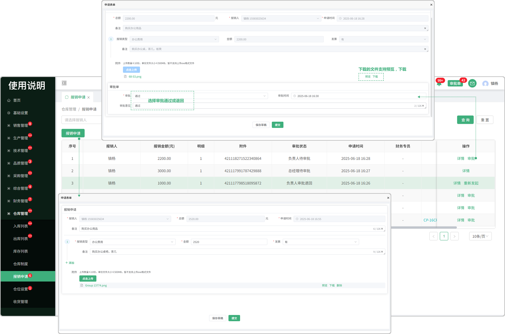
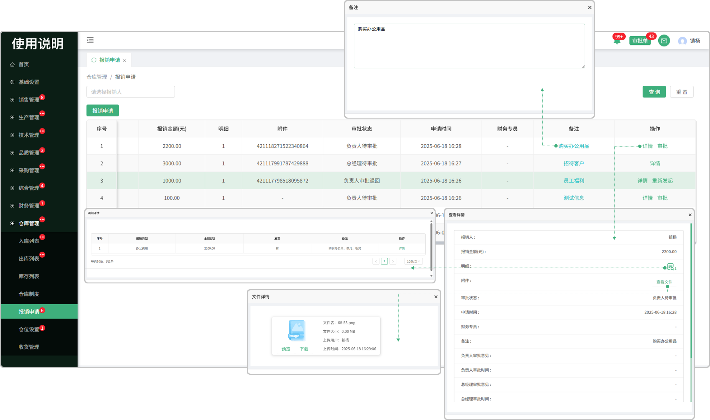

# 报销申请

> "报销申请“位于仓储管理板块，在"报销申请列表"中可新增报销是单子,申请的单子需要去审批,(只有审批这个权限才可以审批,可以去基础设置里面的 "流程权限管理" 去配置权限), 审批不通过被退回了显示 "重新发起" ,有审批的权限显示 "审批" 

#### 1.新增报销申请 

* 点击报销申请按钮可新增申请单

  -可添加多个报销类型（鼠标悬浮在某个报销类型上面出现删除图标，点击图标可删除这个报销类型）

  -可上传多个附件（支持，下载、删除）

  -当保存草稿后，再次点击 "报销申请" 的时候会显示之前所保存的草稿

#### 2.审批

* 新增完报销申请的单子，需要审批通过，退回需重新提交

  -分为审批人、经理、财务（需有权限才可以审批）到基础设置的 ”流程权限管理" 中去设置审批的权限

  -财务审批通过后页面显示财务专员（这个财务元的姓名）

#### 3.重新发起

* 如果在审批的过程中被负责人、经理、财务等任意一方给退回的情况向，页面将显示重新发起

  -可再次点击重新发起这个报销类型去审批

#### 4.详情
* 可以查看当时申请的内容详情

  -点击明细对应的 "图标" 可看到当时申请所添加的费用明细,在明细中也支持查看更详细的 (图标旁边的数字代表当时添加了几个费用的明细)

  -点击附件对应的 "查看详情"可以看到当时所上传的文件信息(支持预览，下载，PDF打印)

#### 5.备注

* 点击备注信息可查看完整版的备注信息

