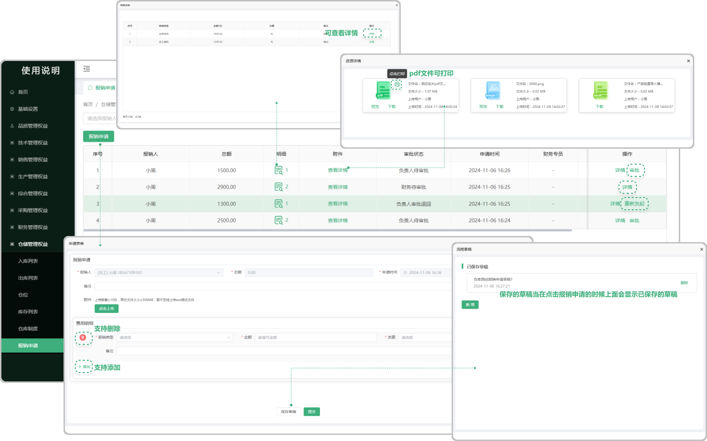

# 报销申请

> "报销申请“位于仓储管理板块，在"报销申请列表"中可新增报销是单子,申请的单子需要去审批,(只有审批这个权限才可以审批,可以去基础设置里面的 "流程权限管理" 去配置权限), 审批不通过被退回了显示 "重新发起" ,有审批的权限显示 "审批" 

#### 1. 如图所示：
* 新增 : 点击报销申请可以生成新的报销单子(支持上传文件, 删除, 添加多个费用明细)
* 审批：只有审批这个权限才可以审批,可以去基础设置里面的 "流程权限管理" 去配置权限
* 明细 : 点击明细下方对应的 "图标" 可看到当时申请所添加的费用明细,在明细中也支持查看更详细的信息(图标旁边的数字代表当时添加了几个费用的明细)
* 附件 : 点击附件下方对应的 "查看详情"可以看到当时所上传的文件信息(支持下载)
* 详情：可以查看当时申请的详细内容
* 保存草稿 :点击保存草稿在新增报销申请时会显示之前保存的草稿

