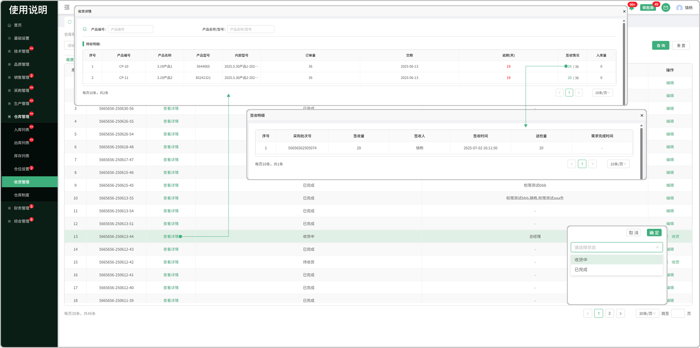
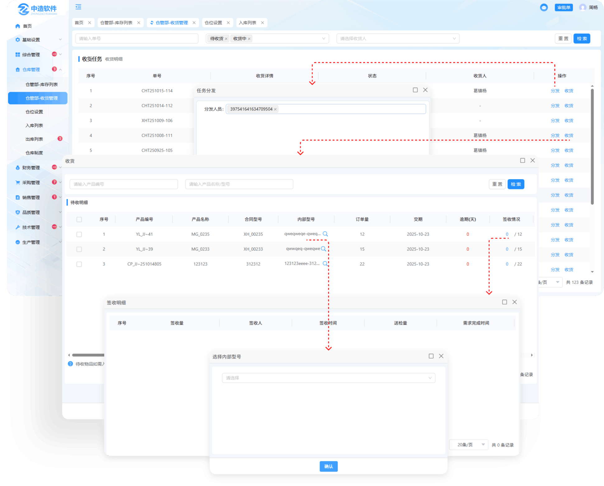
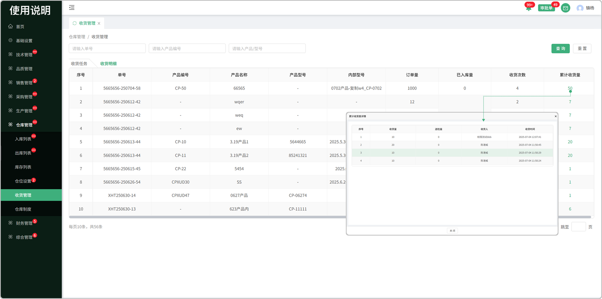

# 收货管理

> "收货管理列表“位于仓储管理板块，分为收货任务，收货明细两个页面，在收货任务中对采购回来的产品/部件等进行分发，收货，送检，则收货明细中记录了收货我详细信息

# 收货任务

#### 1收货详情

* 支持产品编号，产品名称/型号的查找
* 点击收货详情可查看产品/部件等待收明细的详细信息
* 点击签收情况下对应的数字查看签收明细

#### 2.编辑

* 已完成状态下的收货任务，可点击编辑修改状态
    - 状态修改成收货中时，分发和收货按钮再次显示，编辑按钮隐藏
    - 不能改为待收货

#### 3.分发

* 点击分发按钮可将对应的收货单分发给指定的人来完成（支持分发给多个人）

#### 4.收货

* 点击收货按钮对采购回来的产品/部件等进行签收
* 如果签收的产品部件等带有质检项，可进行送检到品质部进行检验入库
* 点击签收情况下对应的数字查看签收明细

# 收货明细

* 在收货明细页面中可查看收货时产品/部件等的详细信息

* 累计收货量可查看当前单号所有收货记录

