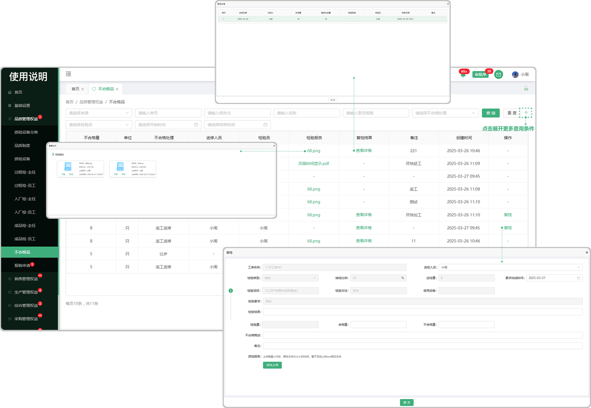

# 不合格品

> "不合格品列表"位于品质管理板块，来源于：1.过程检,入厂检，成品检质检时不合格审批操作 2.返工返修数据送检

#### 1.数据筛选

* 数据筛选：支持来源（检验类型），单号，相关方，名称，型号规格，不合格处理方式，检验员，时间

#### 2. 复检

* 对返工返修的数据进行送检后的复检操作

#### 3.复检结果

* 点击可查看人员所复检的详细情况

#### 4.检验报告

* 点击可查看品质部检验时所上传的检验报告

