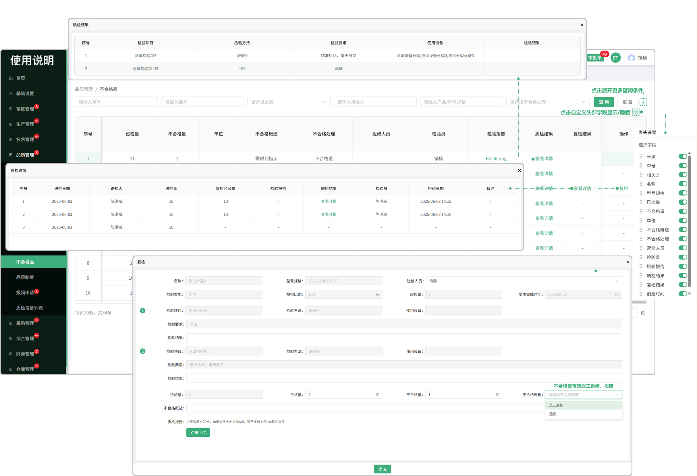

# 不合格品

> "不合格品列表"位于品质管理板块，来源于：1.入库检，成品检质检时不合格审批的操作（整批退，不合格退，特采，挑选使用，返工返修，让步，报废） 2.返工返修数据送检

#### 1.数据筛选

* 数据筛选：支持编号，来源（成品检，入库检），单号，相关方，产品/型号规格，不合格处理，检验员，的查询

#### 2. 复检

* 对返工返修的数据进行送检后的复检操作

* 不合格量可选择返工返修，报废

#### 3.检验报告

* 点击可查看质检时上传的检验报告

#### 4.表头自定义

* 点击表头设置图标可更改表头字段的显示/隐藏

#### 5.详情

* 点击详情可查看此产品的基本信息，质检结果，复检详情

  -质检结果：品质部门检验时所下发的质检结果

  -复检详情：复检完成所产生的结果，可点击查看检验报告和质检结果

