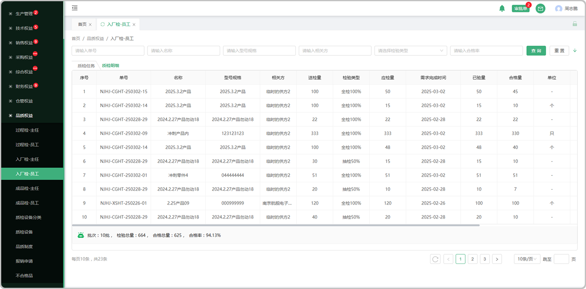

# 入厂检-员工列表

> 主任分发下来的任务会显示在入场检-员工列表，由员工检验完成

#### 1.检验

* 合格的量直接入库

* 不合格的量分为整批退、不合格退、特采、挑选使用

  -整批退的情况下，合格量将不会入库，连同不合格量一起退回，记录会带到不合格列表中

  -不合格退的情况下，合格量入库，不合格将退回，记录会带到不合格列表中

  -特采的情况下，都会入库，选择特采将完结当前批次所有待处理任务，记录会带到不合格列表中

  -挑选使用的情况下，合格品会入库，不合格品不会入库，记录会带到不合格列表中

#### 2.已验量

* 员工检验完成后可以看到已检情况

  -可查看质检详情

  -可查看质检报告

#### 3.合格量

* 员工检验完成后可查看检验成果

  -可查看质检详情

  -可查看质检报告

# 质检明细

> 质检明细页面记录着每个产品的检验详细信息

