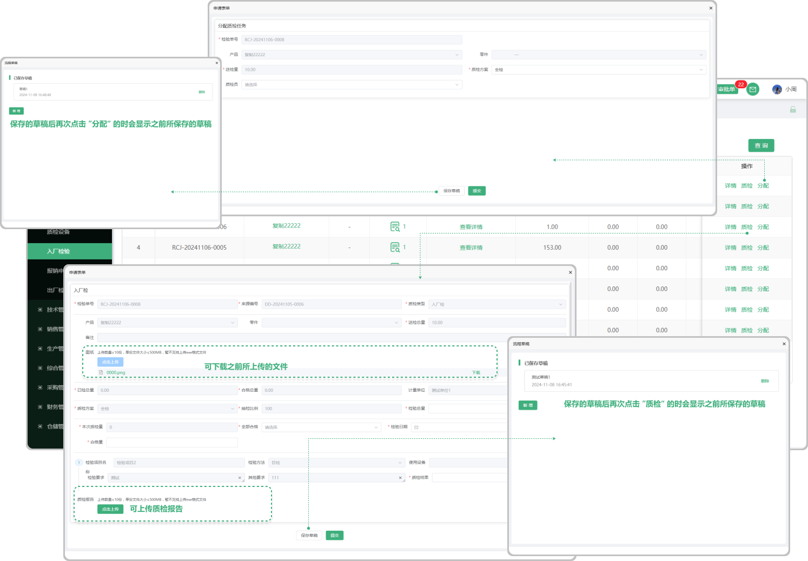
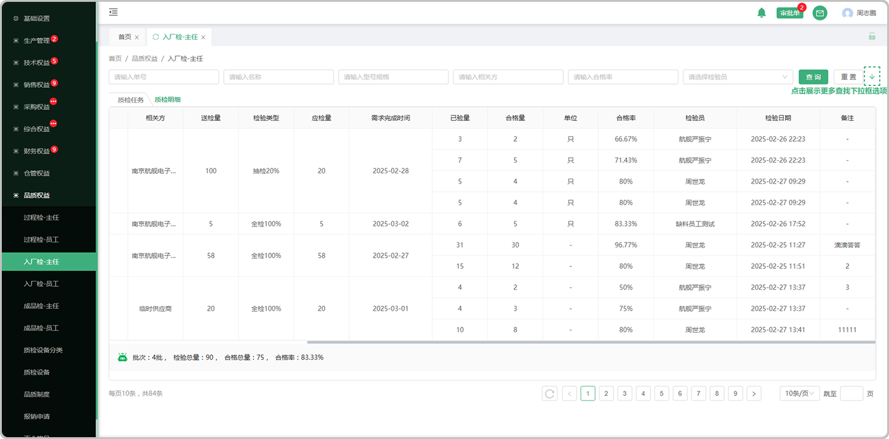

# 入场检-主任列表

> "入厂检验"位于品质管理板块，在采购的 "缺料列表" 收货以后,如果" 产品列表" 中有相同产品并且添加了 "检验准则"，或者生产员工在报工时选择了零件检时，会带入到品质管理的 "入厂检-主任列表由主任分发给员工进行检验

 #### 1.分发

* 点击分发按钮选择检验类型、人员(可分配给多个检验人员)
* 检验类型分为全检、抽检、免检

  -全检指的是检验所有的产品

  -抽检指的是输入百分比抽取部分产品进行检验

  -免检指的是不用检验直接入库

#### 2.批量分发

* 单号和名称一致的情况下可选择批量分发

  -批量分发按钮默认置灰，勾选以后可进行分发

#### 3.已验量

* 主任分配给员工，员工检验完成入库以后主任可以看到员工的检验情况

  -可查看质检详情

  -可查看质检报告

#### 4.合格量

* 主任可以看到员工的检验成果

  -可查看质检详情

  -可查看质检报告

# 质检明细

> 质检明细页面记录着每个产品的检验详细信息

