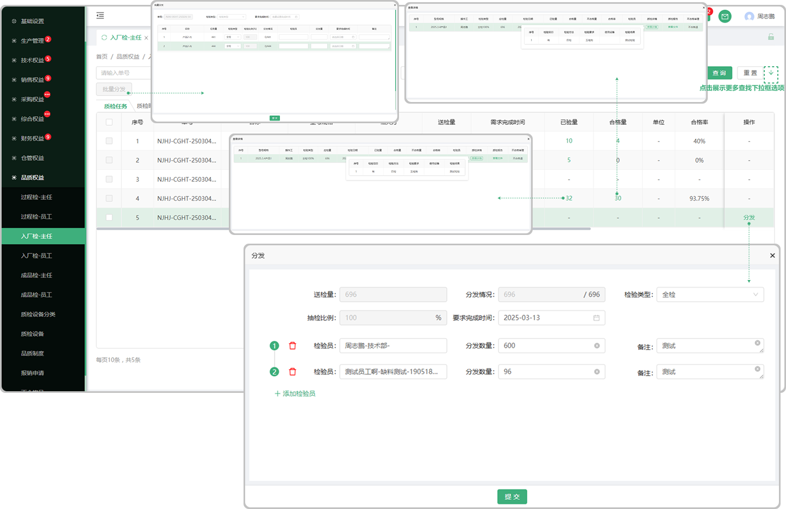
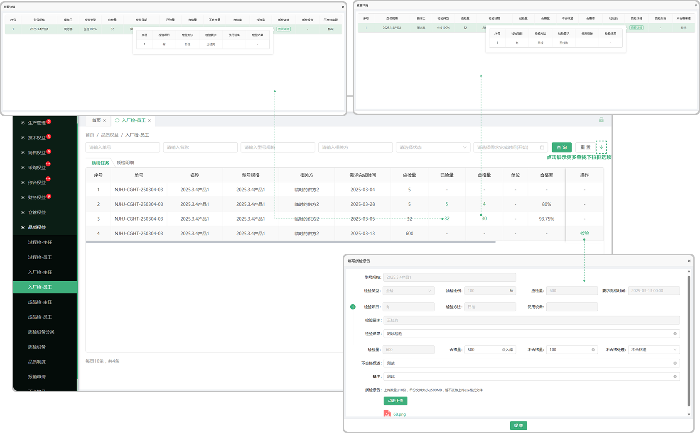

# 入厂检验

> "入厂检验"位于品质管理板块，在采购的 "缺料列表" 收货以后,如果" 产品列表" 中有相同产品并且添加了 "检验准则"时会带入到品质管理的 "入厂检验中去验证

 #### 1. 如图所示：

* 质检：点击质检去检验这个产品，输入检验总量、选择是否合格、输入质检结果并上传检验报告即可（保存草稿以后再次点击 "质检" 时会显示之前所保存的草稿）
* 分配：点击分配，选择质检方案以及质检员即可（保存草稿以后再次点击 ”分配" 的时会显示之前所保存的草稿)

* 产品：点击产品可查看这个产品的基本信息
* 检验项目：指的是在 “产品列表” 中添加零件时添加的检验准则
* 图纸：点击查看当时上传的文件
* 质检明细：是指当质检完成以后，在页面显示质检的明细，点击页面质检明细下方所对应的图标可查看这条数据质检时候的详细信息（图标旁边的数字代表了里面有几条数据）

