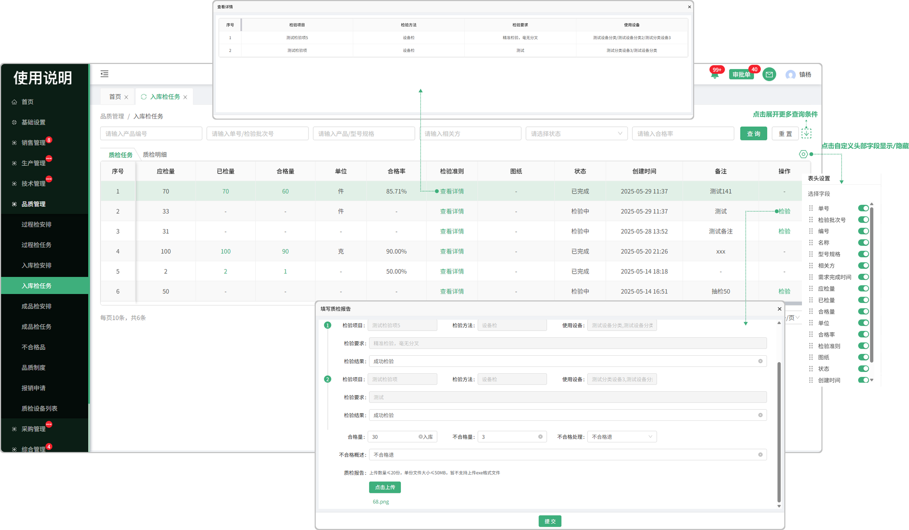
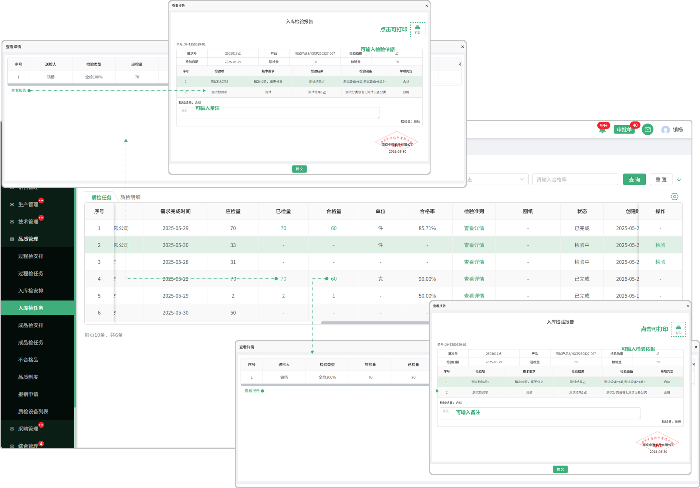
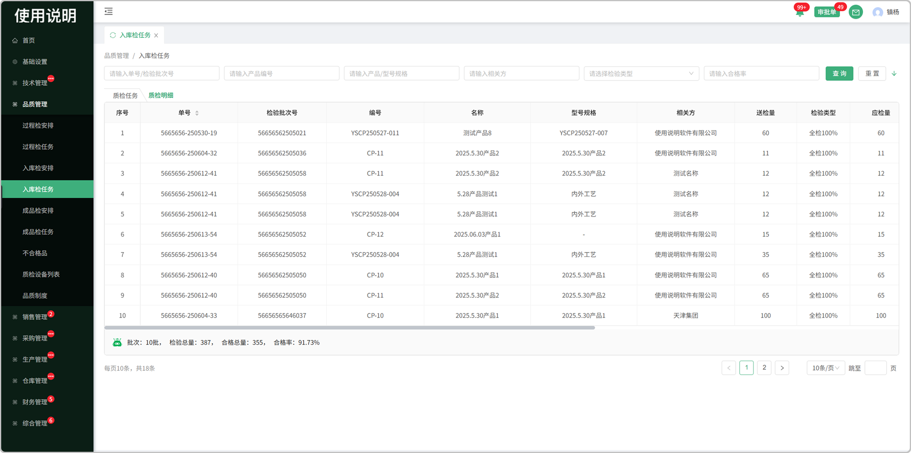

# 入库检任务

> 入库检安排分发下来的任务会显示在入库检任务列表，由员工检验完成

#### 1.检验

* 合格的量直接入库

* 不合格的量分为整批退，不合格退，特采，挑选使用，需审批

  -整批退的情况下，合格量将不会入库，连同不合格量一起退回，记录会带到不合格列表中

  -不合格退的情况下，合格量入库，不合格将退回，记录会带到不合格列表中

  -特采的情况下，都会入库，选择特采将完结当前批次所有待处理任务，记录会带到不合格列表中

  -挑选使用的情况下，合格品会入库，不合格品不会入库，记录会带到不合格列表中

  -填写需带入审批单-质检审批中审批

#### 2.检验准则

* 点击查看这个产品下所配置的检验准则

#### 3.表头自定义

* 点击表头设置图标可更改表头字段的显示/隐藏

#### 3.已检量

* 查看所分发员工完成就检验量

* 存在分发给多个员工去完成

* 查看报告：点击编辑入库检验报告

#### 4.合格量

* 查看所分发员工完成的合格量
* 存在分发给多个员工去完成
* 查看报告：点击编辑入库检验报告

# 质检明细

> 质检明细页面记录着每个产品的检验详细信息

