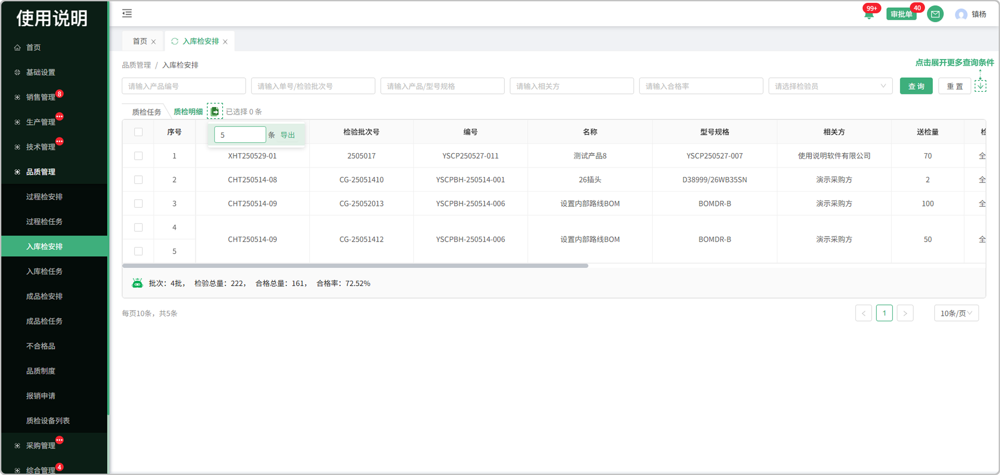

# 入库检验安排

> "入库检安排"位于品质管理板块，产品维护了质检项，采购收货如果送检会生成入厂检任务

 #### 1.分发

* 点击分发按钮选择检验类型，要求完成时间

* 可添加给多个检验人员

  -分发数量不能超过抽检数量

* 检验类型分为全检、抽检、免检

  -全检指的是检验所有的产品

  -抽检指的是输入百分比抽取部分产品进行检验

  -免检指的是不用检验直接入库

#### 2.批量分发

* 勾选序号前的勾选框触发批量分发按钮可进行分发

  -单号与工序均不一致的情况下，不能批量派工

* 选择检验类型，检验员，分发量，要求完成时间，备注信息等可提交分发

  -全检指的是检验所有的产品

  -抽检指的是输入百分比抽取部分产品进行检验

  -免检指的是不用检验直接入库

#### 3.已检量

* 查看所分发员工完成就检验量

* 存在分发给多个员工去完成

* 查看报告：点击编辑入库检验报告

#### 4.合格量

* 查看所分发员工完成的合格量
* 存在分发给多个员工去完成
* 查看报告：点击编辑入库检验报告

#### 5.检验准则

* 点击查看这个产品下所配置的检验准则

# 质检明细

> 质检明细里面记录着每个产品的检验详细信息

#### 1.导出

* 先点击导出图标，触发勾选框

  -可手动输入n条导出，或手动勾选导出

