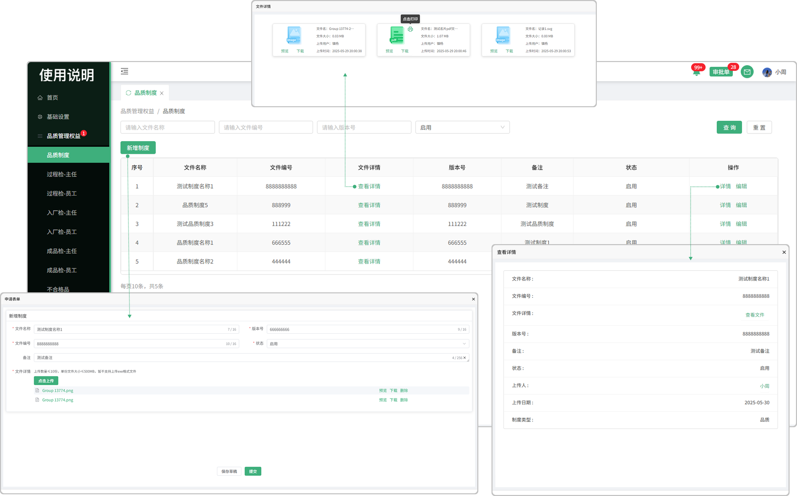

# 品质制度

> "品质制度"位于品质管理板块，在页面中可以新增 “品质制度“可进行编辑

 #### 1.新增制度

* 新增：点击可以新增品质部制度（可上传多个文件）
* 保存草稿：在点击新增的制度时会显示之前保存的制度草稿

#### 2.文件详情

* 点击可查看新增制度时上传的文件（支持预览，下载，PDF打印）

#### 3.详情

* 点击可查看在制度详情

#### 4.编辑

* 点击可对之前所新增的制度编辑

