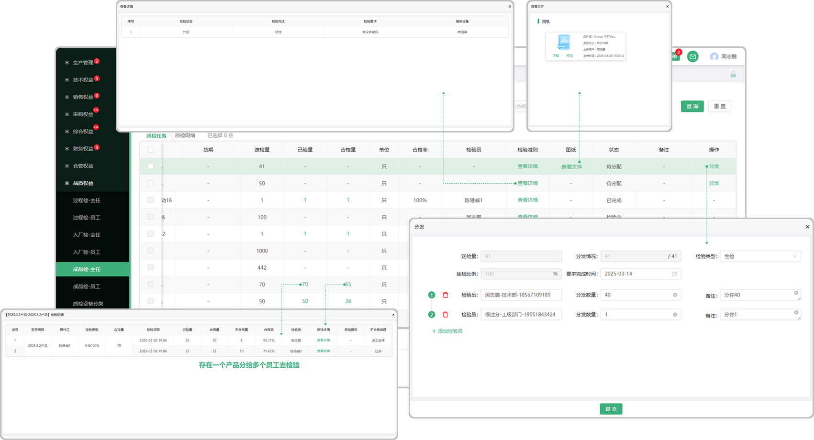
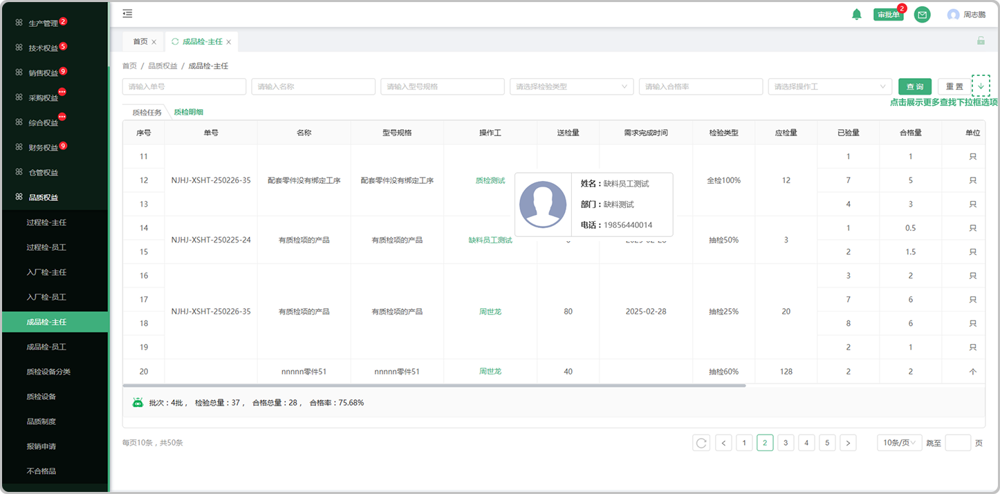

# 成品检-主任页面

> 产品维护了质检项，生产的最后一道工序报工后，生成成品检

#### 1.分发

* 点击分发按钮选择检验类型、人员(可分配给多个检验人员)
* 检验类型分为全检、抽检、免检

  -全检指的是检验所有的产品

  -抽检指的是输入百分比抽取部分产品进行检验

  -免检指的是不用检验直接入库

#### 2.图纸

* 点击查看这个零件/产品的图纸，可下载、预览、pdf打印

#### 3.检验准则

* 点击查看这个零件/产品的的检验准则

#### 4.已发量、合格量

* 当主任分发下去的单子，员工完成以后，主任能看到员工所完成的检验量、合格量

* 存在一个产品/零件分给斗个员工去检验

# 质检明细

> 质检明中记录着每个产品/零件检验的详细记录，同单号、名称、型号、操作工、送检量、完成时间、检验类型的可合并

#### 1.操作工

* 点击人员名称可查看这个操作工的基本信息

