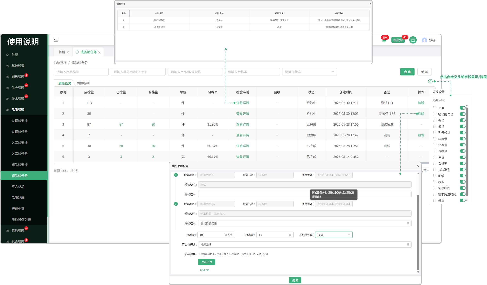
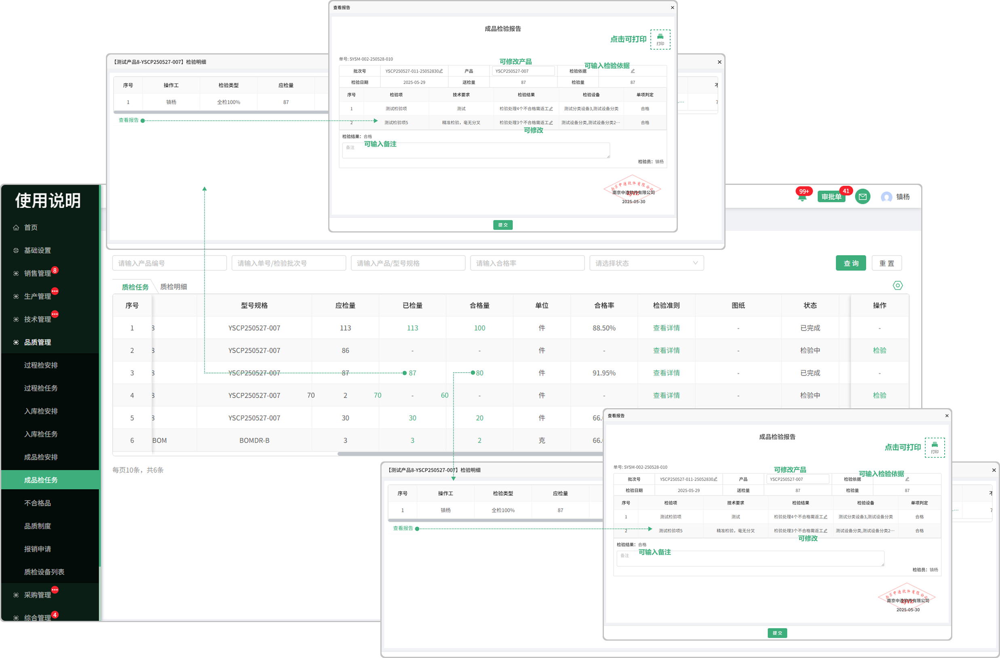
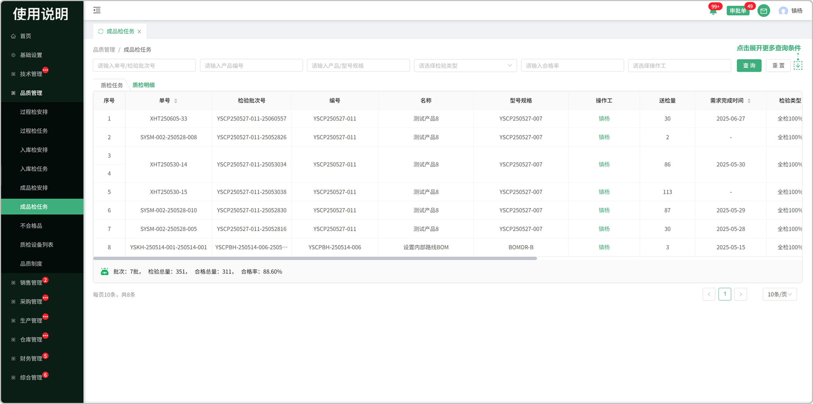

# 成品检任务

> 成品检安排列表中分发下来的任务，员工可检验

#### 1.检验

* 合格的量直接入库

* 不合格的量分为返工返修，让步，报废，需审批

  -返工返修的情况下：会带到生产部门-返工分发，同时品质部门不合格列表同样会显示

  -让步的情况下：全部按照合格量进入到库存

  -报废的情况下：数据报废不可用

  -审批的情况下：点击数据流转到审批单-质检审批中进行审批

#### 2.检验准则

* 点击查看这个产品下所配置的检验准则

#### 3.表头自定义

* 点击表头设置图标可更改表头字段的显示/隐藏

#### 3.已检量

* 查看所分发员工完成就检验量

* 存在分发给多个员工去完成

* 查看报告：点击编辑成品检验报告

#### 4.合格量

* 查看所分发员工完成的合格量
* 存在分发给多个员工去完成
* 查看报告：点击编辑成品检验报告

> 质检明细中记录着每个产品的详细记录

#### 1.操作工

* 悬浮人员名称可查看这个操作工的基本信息

