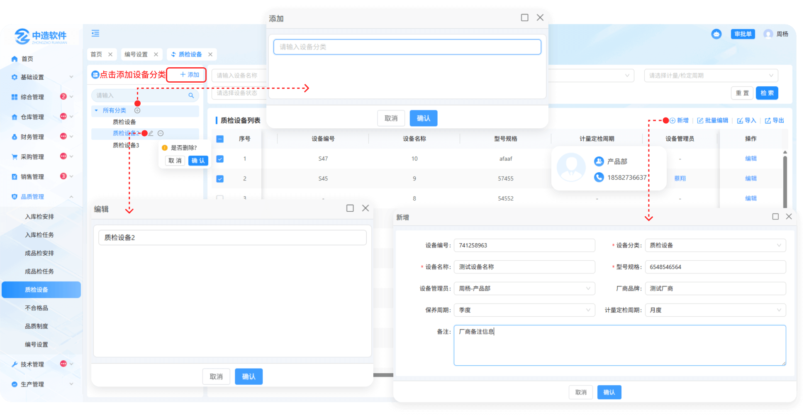
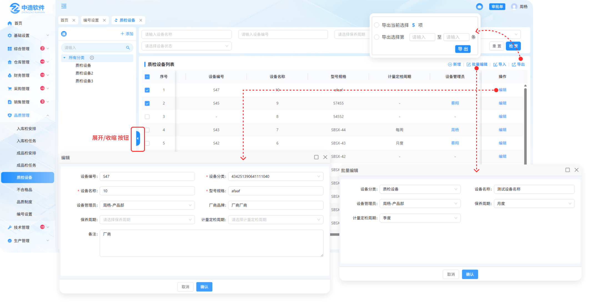
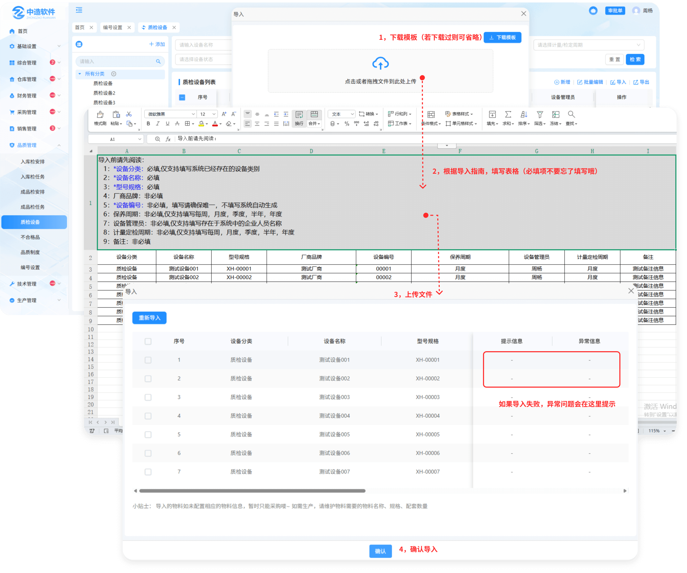

# 质检设备

> "质检设备列表" 位于品质管理，可新增相对应的质检设备

#### 1.新增
* 新增设备时先选择分类

#### 2.设备管理员

* 点击人员名称可查看人员的基本信息（部门，电话）

#### 3.导出

* 点击导出按钮分为两种导出样式

  -先勾选需导出的内容，点击导出按钮选择第一个选项

  -点击导出按钮，选择第二个选项，手动输入导入1~N条****

#### 4.编辑

* 可对新增的设备进行编辑

#### 5.批量编辑

* 先勾选序号前的勾选框，点击批量编辑按钮可进行批量编辑操作

#### 6.导入

* 点击导入图标，先下载模板（注意下载的模板只适用于质检设备列表导入里面上传的模板)
* 点开下载的模板进行编辑（编辑时请阅读表格上面的提示文案，以防导入时出现错误，从而无法导入）
* 点击或者拖拽所保存的模板（只有在质检设备导入中下载的模板才能上传，其他无效）进行上传
* 上传成功会弹出显示上传的数据，可选择性导入或者一键导入（如果无法导入，请滑动到页面最后，查看提示信息，可能存在编辑时出现的错误，需从新更改再次上传）

