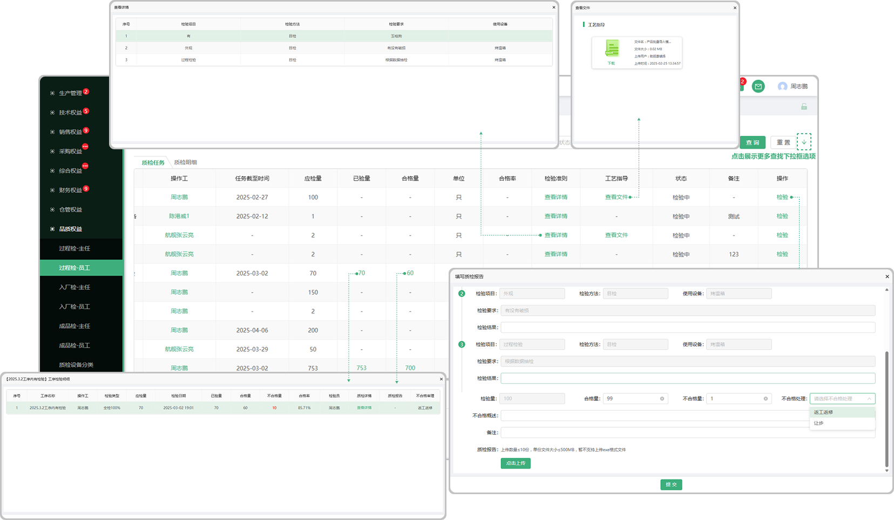
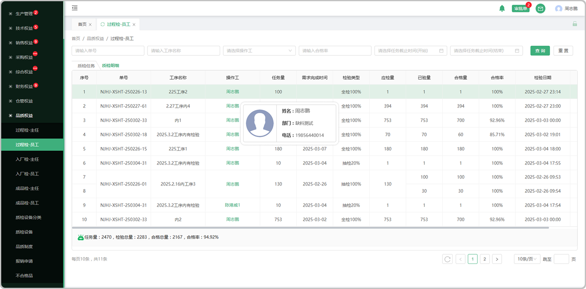

# 过程检-员工页面

> 主任分发下来的任务会显示在过程检-员工列表，由员工检验完成

#### 1.检验

* 合格的量直接入库

* 不合格的量分为返工返修、让步

  -返工返修的情况下：会带到生产部门-返工返修页面，同时品质部门不合格列表同样会显示

  -让步的情况下：

#### 2.工艺指导

* 点击时可查看这个产品/零件所上传的工艺指导

#### 3.检验准则

* 点击查看这个零件/产品的的检验准则

#### 4.已验量

* 员工检验完成后可以看到已检情况

  -可查看质检详情

  -可查看质检报告

#### 5.合格量

* 员工检验完成后可查看检验成果

  -可查看质检详情

  -可查看质检报告

# 质检明细

> 质检明细页面记录着每个产品的检验详细信息

