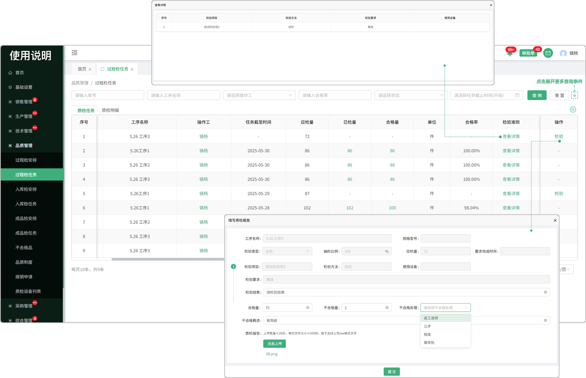
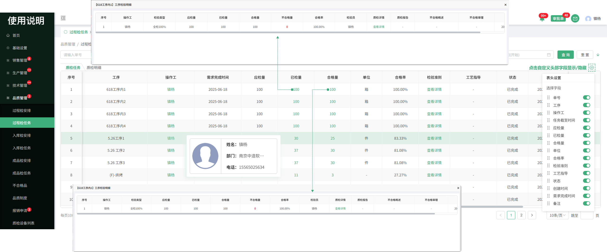
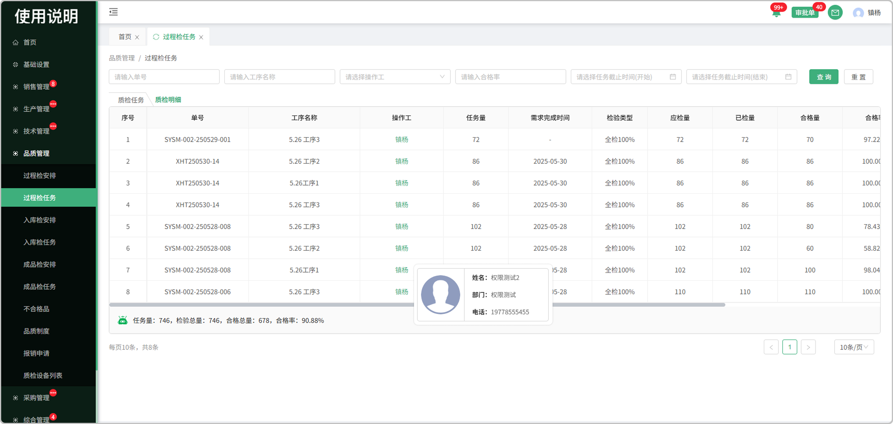

# 过程检任务

> 过程检安排列表中分发下来的任务，可进行检验

#### 1.检验

* 合格的量直接入库

* 不合格的量分为返工返修、让步，报废，需审批

  -返工返修的情况下：会带到生产部门-返工分发，同时品质部门不合格列表同样会显示

  -让步的情况下：全部按照合格量进入到库存

  -报废的情况下：数据报废不可用

  -审批的情况下：点击数据流转到审批单-质检审批中进行审批

#### 2.检验准则

* 点击查看这个零件/物料下所配置的检验准则

#### 3.工艺指导

* 点击时可查看这个工序所上传的工艺指导

#### 4.已验量

* 员工检验完成后可以看到已检情况

  -可查看质检详情

  -可查看质检报告

#### 5.合格量

* 员工检验完成后可查看合格量

  -可查看质检详情

  -可查看质检报告

#### 6.表头自定义

* 点击表头设置图标可更改表头字段的显示/隐藏

# 质检明细

> 质检明细页面记录着每个产品/物料的检验详细信息

