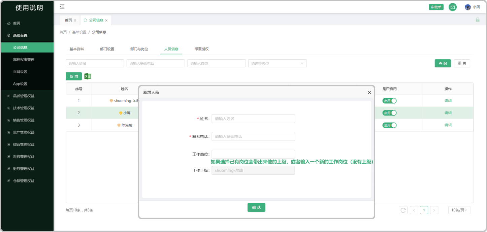

# 人员信息

> 人员信息板块是管理信息系统或人事管理系统中的一个关键组成部分，它主要负责存储、管理和维护员工的基本信息，以及提供相关的数据支持和查询功能。

#### 1. 新增人员
* 可以新增人员信息也可以批量导入员工，可以启用员工信息或停用，在停用的情况下是不可以编辑员工信息的，停用时系统内不显该员工的信息资料  

* （管理员，运营管理员权限）基础设置-人员信息，人员进行姓名，手机号，岗位修改后，如果综合管理-员工档案列表已录入人员信息，直接进行数据更新

