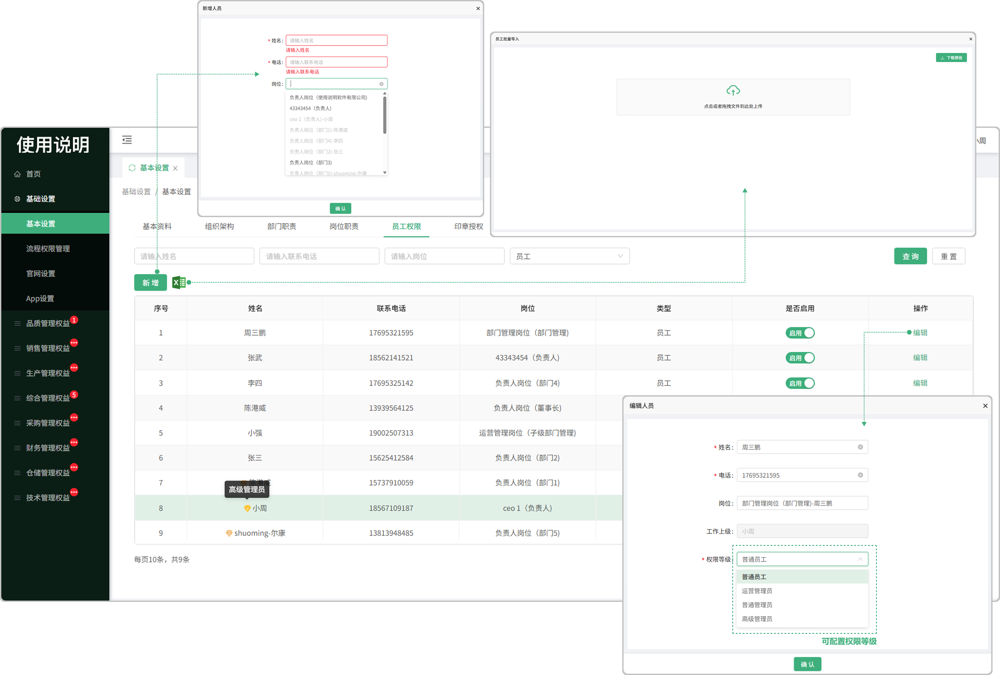

# 员工权限

> 员工权限是管理信息系统或人事管理系统中的一个关键组成部分，它主要负责存储、管理和维护员工的基本信息，以及提供相关的数据支持和查询功能，（以基础设置-人员信息中的数据为准，同步至员工档案）
> 
> 点击编辑可配置员工的权限等级，高级管理员可配置所有员工权限，管理员可配置，普通员工，运营管理员，普通管理员，

#### 1. 新增人员
* 可以新增人员信息也可以批量导入员工信息，可以启用员工信息或停用，在停用的情况下是不可以编辑员工信息的，停用时系统内不显该员工的信息资料  

* 新增员工时，如果员工档案中不存在此人的人员信息，人员信息同步至员工档案（姓名，手机号，岗位，启停状态）

* 新增员工时，员工档案中存在此人员信息，如果数据进行了修改，应该更新人员信息至员工档案（姓名，手机号，岗位，启停状态）

#### 2.是否启用

* 启用的情况下这个员工可登录系统，不启用的情况下员工无法登录账号

* 在停用的情况下是不可以编辑员工信息的，停用时系统内不显该员工的信息资料

* 修改员工启停状态时，也将状态同步至员工档案表中的在职离职字段

#### 3.批量导入

* 点击批量导入，下载模板，编辑模板后上传即可

#### 4.编辑

* 点击编辑可更改员工的姓名、电话、岗位、工作上级、权限等级

 

 