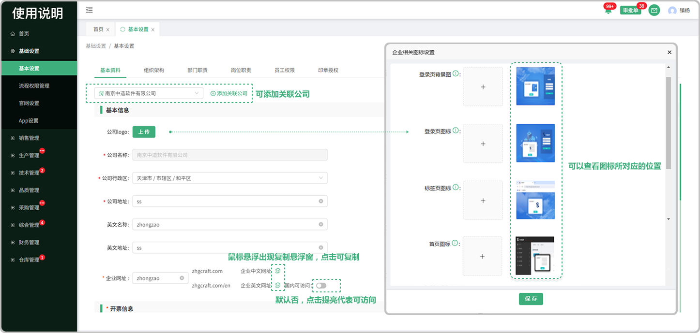
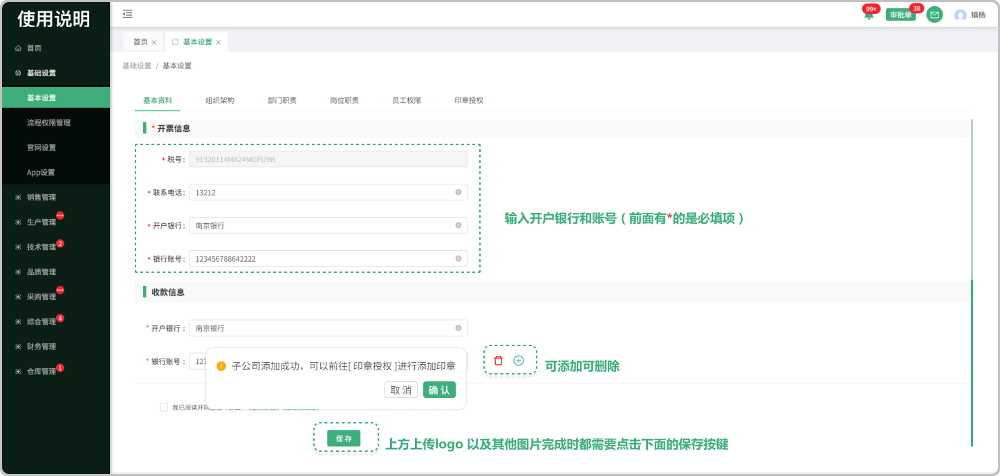

# 基本资料

> 基本资料归属于系统的基本信息填写：分为 基本信息、开票信息、收款信息

#### 1. 如图所示：
* 图1中在点击公司logo上传保存成功还需下滑到页面底层在次点击保存即可
* 图2中可以添加 开户银行以及账号 和收款信息 （可以添加多个）
* 企业网址:点击后面的图标可复制企业系统的网址 (指的是所登录的这个系统的网址) 和 企业中文官网的网址 (指的是这个系统官网的网址)

