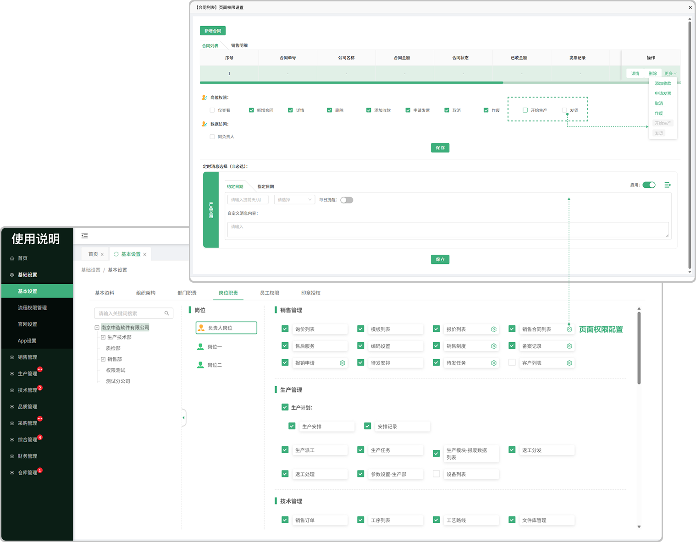
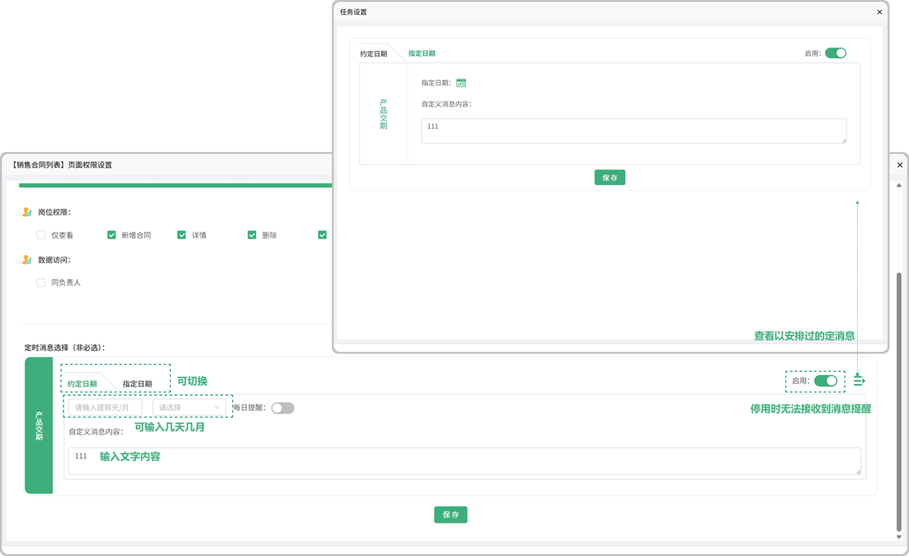
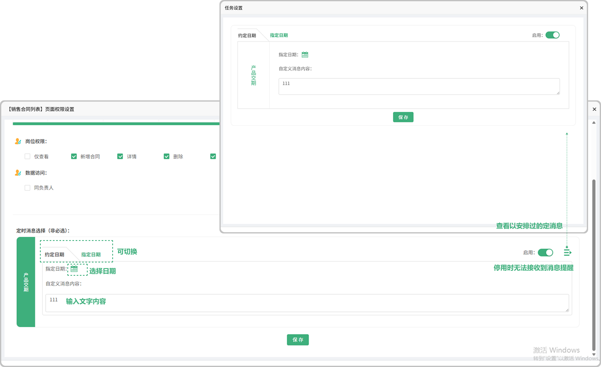

# 岗位职责

> 可编辑修改岗位的职责
 
#### 1. 岗位

* 是在组织架构中所添加的岗位
 

#### 2.页面权限品质

点击设置图标打开弹窗可对展示的页面进行配置

#### 3.定时消息提醒

* 约定日期

  -启用的时候可接收到消息提醒，不启用时接收不到消息提醒

  -点击图标可查看全部安排过的定时任务

* 指定日期

   -启用的时候可接收到消息提醒，不启用时接收不到消息提醒
   
   -点击图标可查看全部安排过的定时任务

