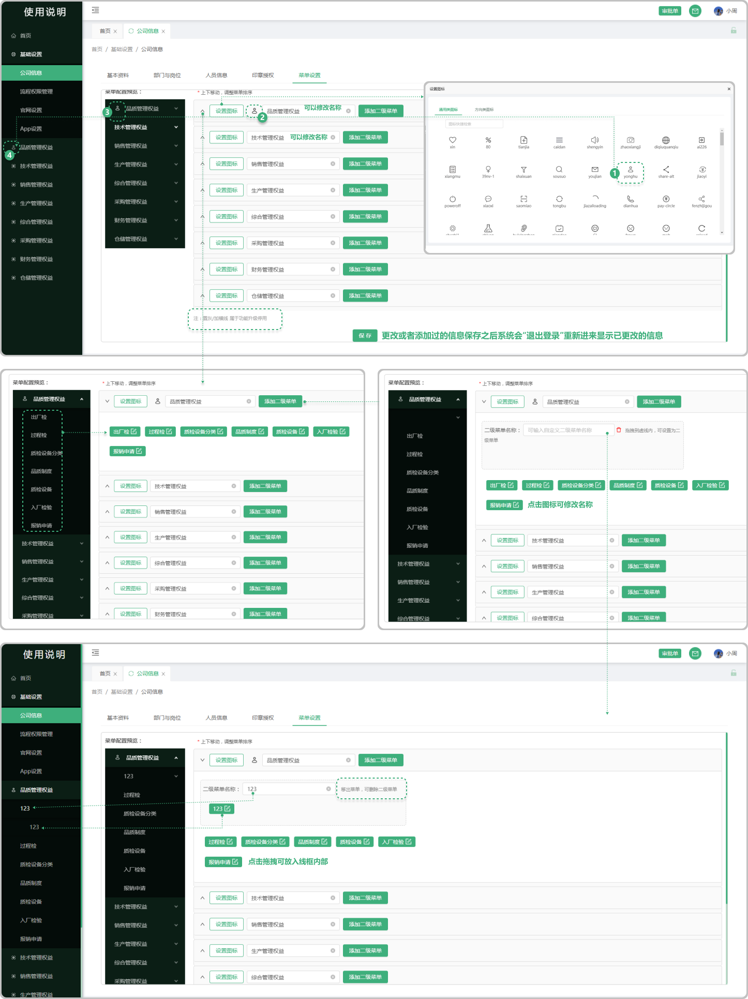

# 菜单设置

> 菜单设置是系统菜单栏编辑的地方，支持换图标、添加二级菜单和修改菜单名称
 
#### 1. 设置图标
 
* 点击设置图标按钮，弹出图标库，可设置相对应的页面图标

* 可更改菜单栏的名称
 
* 更改或者添加过的信息保存之后系统会“退出登录”重新进来显示已更改的信息

#### 2.添加二级菜单

* 点击添加二级菜单按钮可添加二级菜单

 -可输入自定义二级菜单名称

 -可点击小笔图标更改菜单名称s

 -把所添加的二级菜单拖拽到虚线内，可设置为二级菜单（移除框内代表删除二级菜单）

