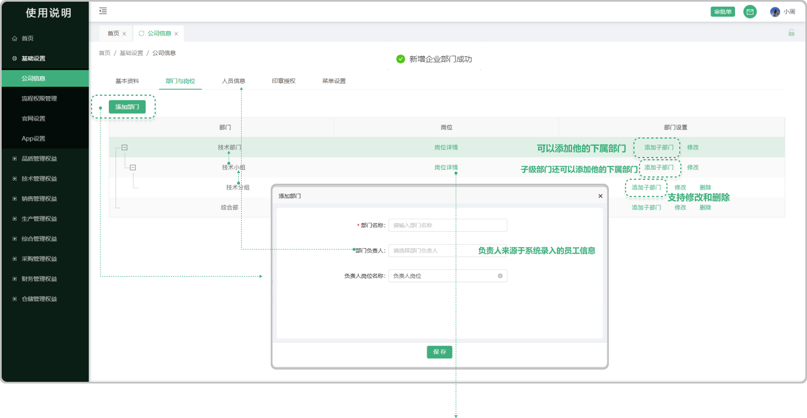
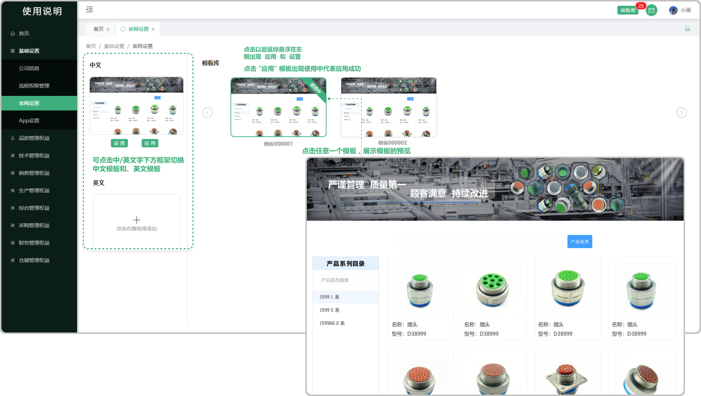

# 部门与岗位

> 部门与岗位是组织结构的两个核心组成部分，它们共同构成了组织的基本框架，确保组织能够高效、有序地运作。部门：是组织内部按照业务功能或管理职能划分的单元。每个部门都承担着特定的职责和任务，以确保组织整体目标的实现。  岗位：是组织内部为了完成特定任务而设置的工作职位。每个岗位都有明确的职责、权限和工作要求，以确保部门目标的实现。

###  一、可以新增部门，同时可以 “添加子级部门” ，在 “子级部门” 下面还可以 ”添加子级部门" 以此类推

#### 1. 如图所示： 
* 点击 添加部门

#### 2. 如图所示：点击岗位详情跳出弹窗进行下一步的 “添加岗位”
> 点击岗位详情弹出弹窗进行编辑，可在弹窗中添加新的岗位（可编辑、删除），可在菜单栏中勾选当前岗位需要使用的功能，支持预览所勾选的字段，如果页面出现 "当前页面展示的数据已配置好"的情况，说明是静态页面，不需要进行配置

* 添加岗位：可添加新的岗位（添加的岗位均为部门负责人下平级岗位）（支持删除、编辑）
* 预览：点击预览可预览所勾选的字段（在菜单栏中选系统页面，没选中的情况下不显示 ”预览“这个按钮）
* 编辑小笔：悬浮或者点击出现的小笔图标均可编辑
* 行数据权限：查看当前部门下所有的数据

