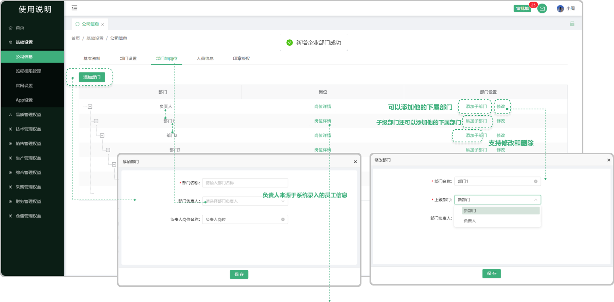

# 部门与岗位

> 部门与岗位是组织结构的两个核心组成部分，它们共同构成了组织的基本框架，确保组织能够高效、有序地运作。部门：是组织内部按照业务功能或管理职能划分的单元。每个部门都承担着特定的职责和任务，以确保组织整体目标的实现。  岗位：是组织内部为了完成特定任务而设置的工作职位。每个岗位都有明确的职责、权限和工作要求，以确保部门目标的实现。

#### 1.添加部门

* 添加部门：点击可添加新的部门
* 添加子部门：在部门里可以添加它的子部门，子部门接着也可以添加它的子部门（以此类推）
* 修改：可修改部门名称，上级部门选择（新部门）是代表不属于子部门，是单独的部门
* 删除：在没有子部门的的情况下支持删除

#### 2.点击岗位详情跳出弹窗进行下一步的 “添加岗位”
> 点击岗位详情弹出弹窗进行编辑，可在弹窗中添加新的岗位（可编辑、删除），可在菜单栏中勾选当前岗位需要使用的功能，支持预览所勾选的字段，如果页面出现 "当前页面展示的数据已配置好"的情况，说明是静态页面，不需要进行配置

* 添加岗位：可添加新的岗位（添加的岗位均为部门负责人下平级岗位）（支持删除、编辑）
* 预览：点击预览可预览所勾选的页面（在菜单栏中选系统页面，没选中的情况下不显示 ”预览“这个按钮）
* 编辑小笔：悬浮或者点击出现的小笔图标均可编辑
* 行数据权限：查看当前部门下所有的数据

#### 3.定时消息选择
> 基础设置-岗位详情界面，新增了员工生日，合同续签，设备计量定检周期和设备保养周期定时消息提醒设置

* 员工生日-约定日期

  -只需要设置提前提醒的天数和是否进行每日提醒，系统自动进行消息提醒的发送

  -通过每日提醒启停按钮设置是否每日发送提醒消息

  -消息提醒的启停：通过页面启用按钮进行设置，高亮状态为启用，再次点击变为置灰状态为停用，停用后提醒不再发送。

  -例如员工生日提醒，A员工生日12.28，设置了提前15天，每日提醒，则会在12.13号开始，每日都会进行消息提醒的发送

  -消息提醒设置提醒范围：通过勾选岗位设置消息提醒的人员范围，处于岗位下的人员均会收到消息提醒通知

  -所接受的信息会通知在首页的信息列表中（点击首页上方小铃铛图标方可查看）

  -点击全部展示按键可查看更多定时信息（可编辑修改）

* 员工生日-指定日期

  -点击日历图标用户可以指定提醒日期和提醒的时间范围，方式

  -设置了指定日期，通过指定日期时间方式进行了消息通知

  -消息提醒的启停：通过页面启用按钮进行设置，高亮状态为启用，再次点击变为置灰状态为停用，停用后提醒不再发送

  - 消息提醒设置提醒范围：通过勾选岗位设置消息提醒的人员范围，处于岗位下的人员均会收到消息提醒通知

  -所接受的信息会通知在首页的信息列表中（点击首页上方小铃铛图标方可查看）

  -点击全部展示按键可查看更多定时信息（可编辑修改）

* 合同签约-约定日期-指定日期

   -和上方员工生日信息一致，可参考员工生日定时消息提醒

