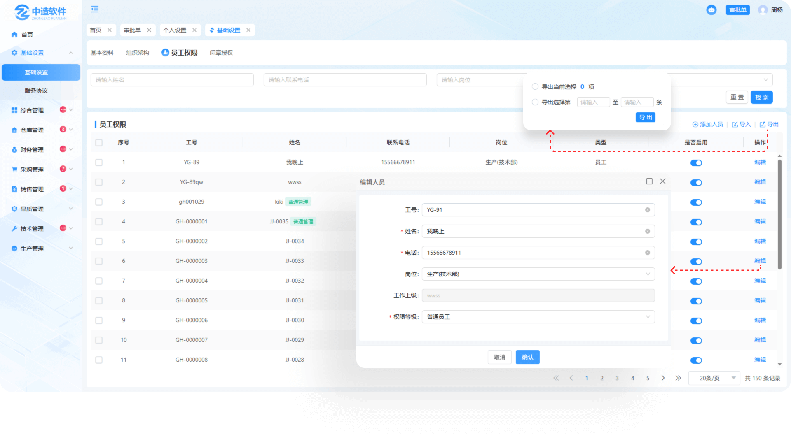

# 员工权限

> 员工权限是管理信息系统或人事管理系统中的一个关键组成部分，它主要负责存储、管理和维护员工的基本信息，以及提供相关的数据支持和查询功能，（以基础设置-员工信息数据为准，同步至员工档案）
> 
> 高级管理员可配置所有员工权限，普通管理员可配置，普通员工，运营管理员

#### 1. 新增人员
* 点击添加人员图标，可新增人员信息的工号，姓名，电话，岗位

* 新增员工时，如果员工档案中不存在此人的人员信息，人员信息同步至员工档案（姓名，手机号，岗位，启停状态[在职/离职]）

* 新增员工时，如果员工档案中存在此人员信息，当人员信息进行了修改（姓名或电话与员工档案中记录数据至少有一个信息不同），更新人员信息至员工档案（姓名、手机号、岗位、工作上级）

#### 2.是否启用

* 启用的情况下这个员工可登录系统，不启用的情况下员工无法登录账号

* 在停用的情况下是不可以编辑员工信息的，停用时系统内不显该员工的信息资料

* 修改员工启停状态时，也将状态同步至员工档案表中的在职离职字段，其他界面涉及员工信息弹窗会显示离职状态

#### 3.批量导入

* 点击批量导入，下载模板，编辑模板后上传即可

#### 4.编辑

* 点击编辑可更改员工的工号，姓名、电话、岗位、工作上级、权限等级，提交后同步至员工档案（工号，姓名，电话，岗位，工作上级）

#### 5.导出

-点击导出按钮

-勾选需要导出的信息

-也可手动输入需导出N条信息进行导出

-再次点击导出按钮导出

 

 