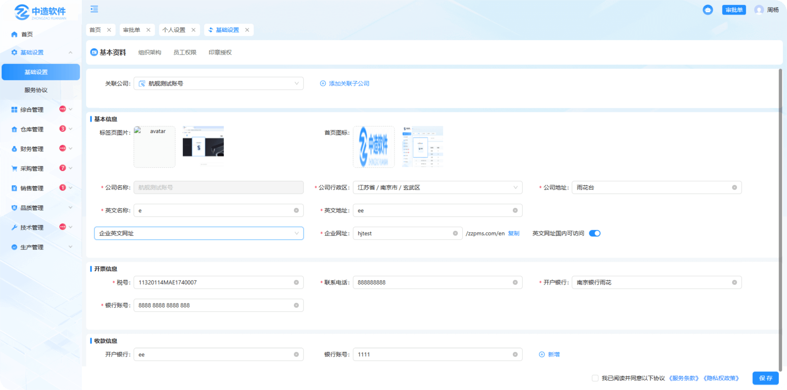

# 基本资料

> 基本资料归属于系统的基本信息填写：分为 基本信息、开票信息、收款信息

#### 1.添加关联公司

> 使用【中造-PMS】的用户，可以在基本信息中添加多个关联公司，关联公司有自己独立的税号、印章等信息

*  通过基础设置-基本资料页面进行关联公司的添加，只有主公司才能够添加关联公司

* 主公司前面显示图标，子公司不显示图标

#### 2.基本信息

* 标签页上传：点击上传相关图片，确认后还在页面底部需勾选协议点击保存

* 首页图标：点击公司logo上传相关照片，确认后还在页面底部需勾选协议点击保存

 -上传时可点击弹窗中的照片提示，查看照片所上传的位置

 

 -企业中文网址：（中文官网的网址）根据前面输入的企业网址+后面固定的网址所生成，可点击复制图标进行复制

 -企业英文网址：（英文官网的网址）根据前面输入的企业网址+后面固定的网址所生成，可点击复制图标进行复制

 -英文网址后面，点击按钮提亮，代表国内用户可访问

#### 3.开票信息

* 可以添加开户银行以及账号

  -用于签章合同时所带的开户银行、银行账号

#### 4.收款信息

* 可添加需要收款的开户银行以及账号（支持添加多个）

