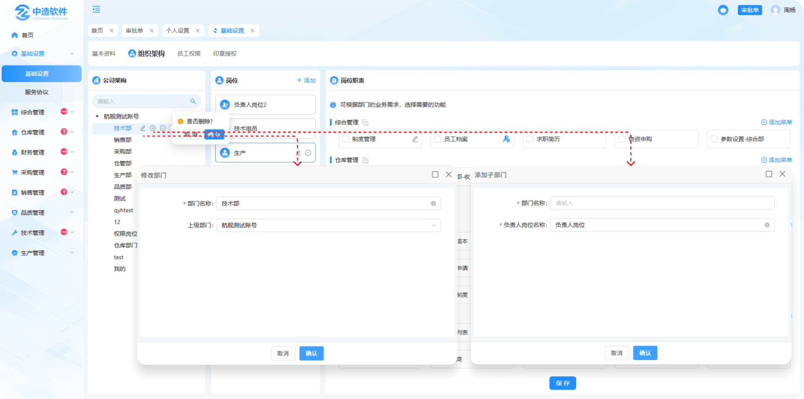
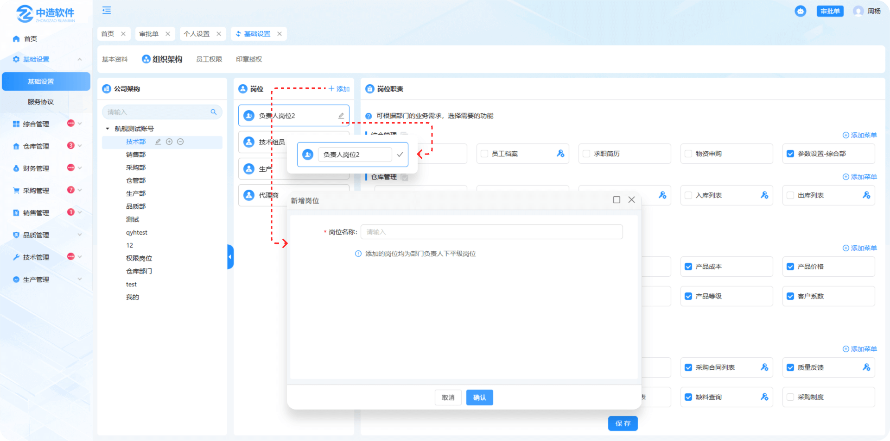
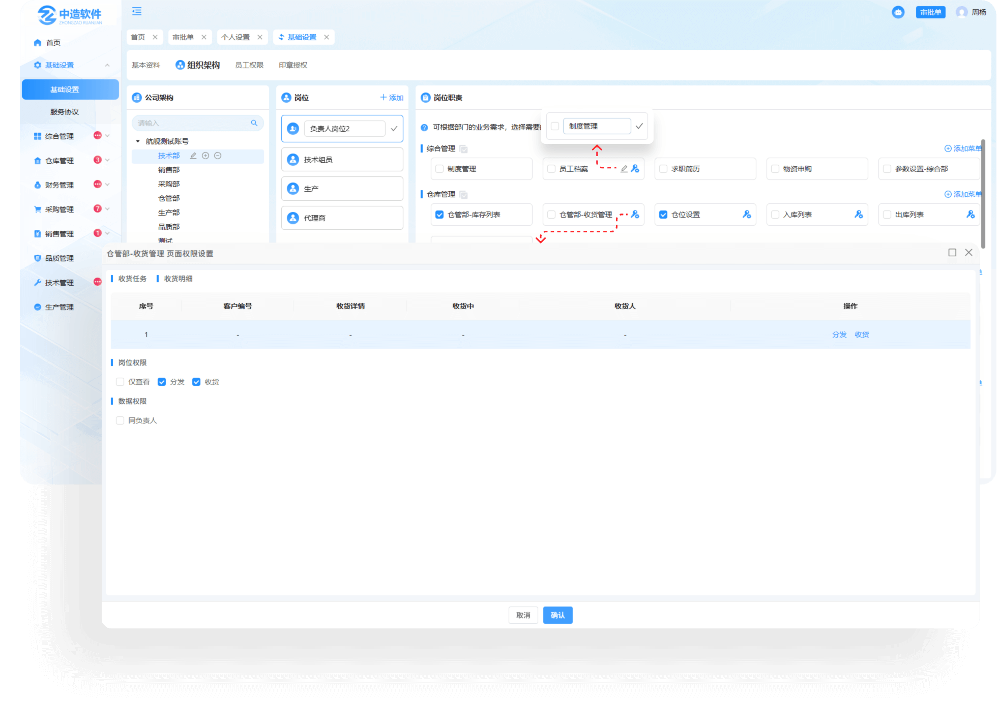
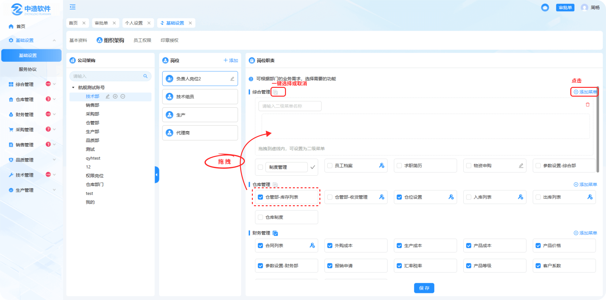

# 组织架构

> 是系统内的组织架构，展示公司大小部门以及岗位的信息

#### 公司架构

* 可在输入框中输入关键词进行索搜
* 点击第一个编辑图标，可进行部门的信息修改
* 点击第二个新增图标，可进行添加部门
* 点击第三个删除图标，可进行删除部门

#### 岗位

* 点击添加可新增岗位（添加的岗位均为部门负责人下平级岗位）
* 点击下方编辑图标，可对岗位的名称进行编辑，编辑完成需点击“对号”图标，显示更新企业岗位成功后方可完成

#### 岗位职责

* 点击编辑图标，可对岗位的名称进行编辑，编辑完成需点击“对号”图标，后方可完成

* 点击钥匙图标（权限设置），在弹窗中进行相对应的页面信息设置

* 点击添加菜单按钮，可输入菜单名称，同时将下方的页面模块拖拽到虚线内，可设置为二级菜单
* 支持一键选择或取消
* 点击删除图标可删除所添加的菜单（如果虚线内有拖拽进来的模块不支持删除，切全部拖拽出去才显示删除图标）

