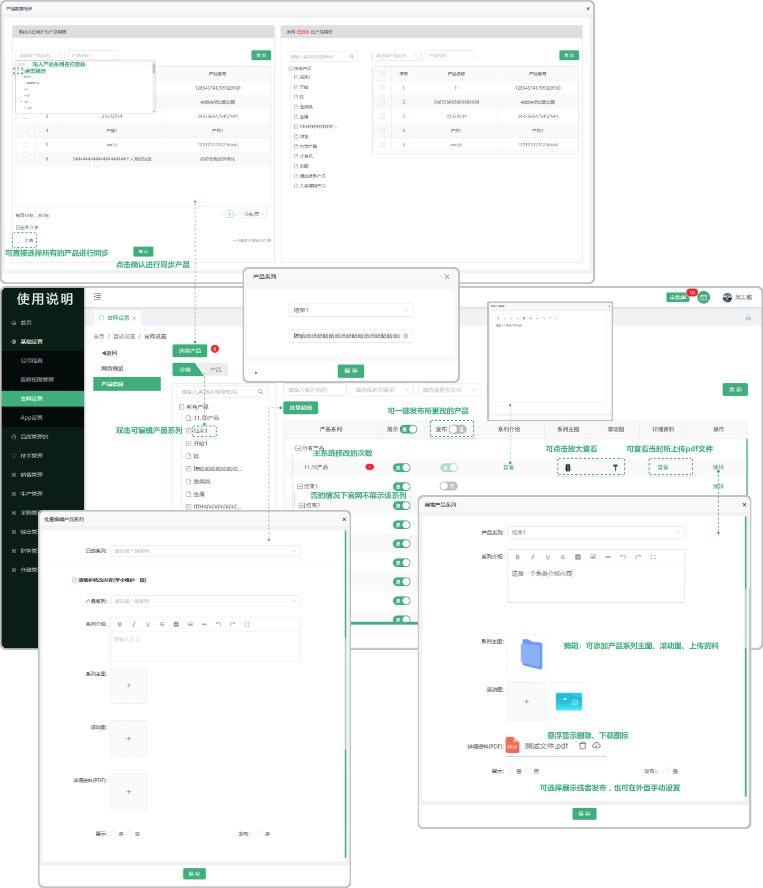
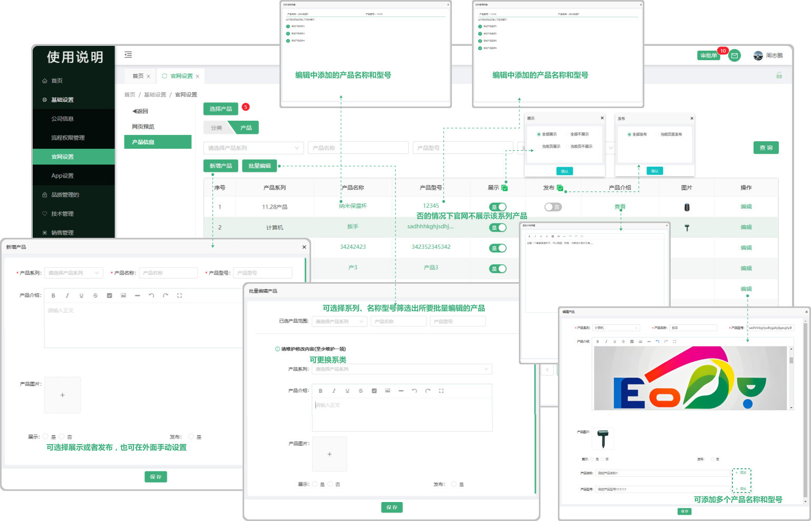

# 产品展示

> 产品信息:分为分类、产品，在产品信息中可以去同步系统的产品，包括修改、展示、发布、查看、新增、批量编辑
#### 1.产品分类

* 选择产品：旁边红色数字提示显示的是有多少个产品需要同步，点击打开弹窗可选择产品同步，左边表格代表的是系统的产品信息，左边表格代表的是官网已发布的产品信息，选中左边的产品会对应到右边官网已发布的产品进行同步，也可点击下方的全选一次性进行同步，最后点击确认即可
* 系列：在分类页面中左边的系列中可双击系列的名称，打开弹窗可更改产品名称和转移产品位置（上面索搜框可选择调整产品的位置。下面的输入框可更改产品的名称）
* 展示：点击表格中的展示字段的按钮可一键展示所有产品（展示以后官网可以看到这个产品的信息）
* 发布：在页面编辑或者更改信息以后，可以点击发布到官网（发布到官网的信息是更改以后的，如果不发布官网的信息还是之前未更改的信息）
* 表格中的产品气泡数字：指的是产品的修改次数
* 系列介绍：点击系列介绍下方对应的产品“查看”可以查看这个产品的详细介绍内容
* 系列主图、滚动图：点击下方的图片可放大预览
* 编辑：可以对这个产品的信息进行编辑更改（包括产品系列、产品介绍、产品主图、滚动图、详细资料）可直接选择展示或者发布（也可不选择到外面选择展示或者发布）
* 批量编辑：可以批量进行编辑，选择系列以后编辑下方的信息（至少维护修改一项），保存以后这个已选产品系列的内容会发生更改

#### 2.产品

* 新增产品：点击新增产品可打开弹窗编写产品内容，可直接选择展示或者发布（也可不选择到外面选择展示或者发布）
* 批量编辑：点击批量编辑可打开弹窗批量编辑产品，选择任意产品范围（系列、名称、型号）至少维护一项，产品系列的选择框（是指可以更换产品系列，可更换到选中的系列中）
* 展示：可在新增或者编辑的时候直接选择展示，也可在表格上方的展示字段旁点击小图标，弹出弹窗可选择（全部展示、全部不展示、当前页展示、当前页不展示）
* 发布：可在新增或者编辑的时候直接选择展示，也可在表格上方的发布字段旁点击小图标，弹出弹窗可选择（全部发布、当前页面发布）

