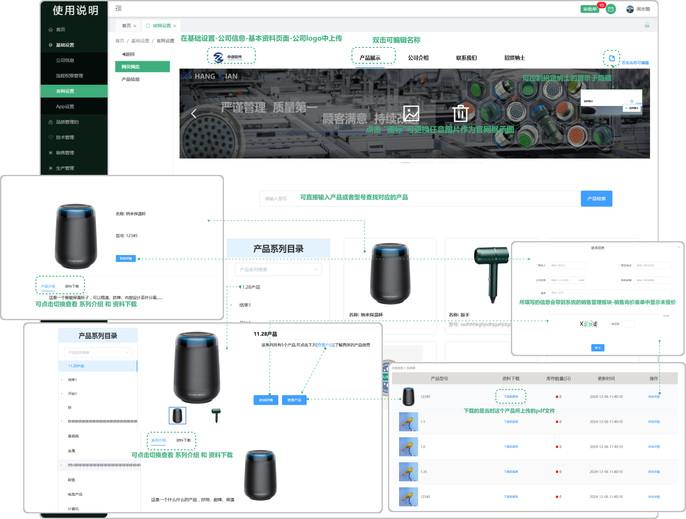
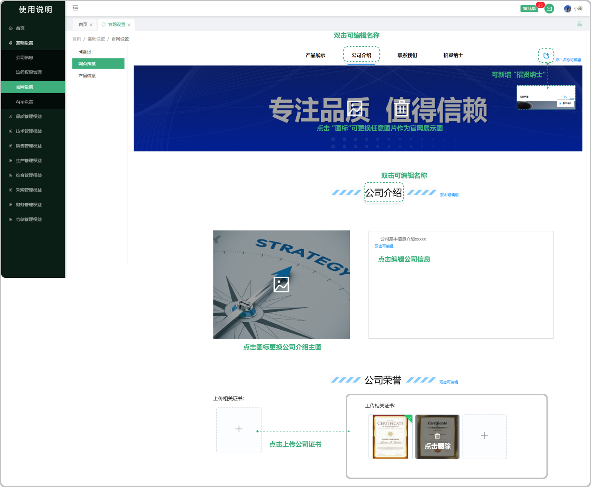
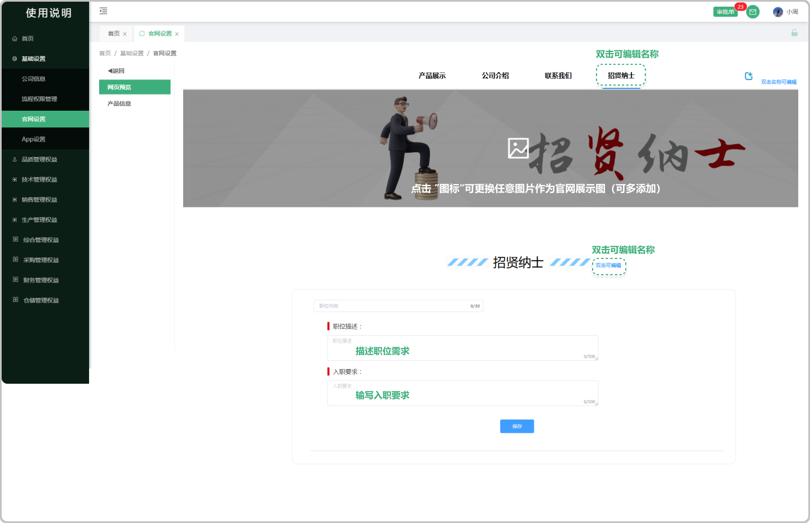

# 网页预览

> 官网基本信息分为、产品展示、公司介绍、联系我们、招贤纳士，在内部编辑（显示可编辑文字的均可编辑）完点击 “保存” 可同步官网

#### 1. 如图所示：
* 产品展示：点击上方的产品展示可文字双击可编辑
* 鼠标悬浮在banner横幅图上面显示图标可更换图片和删除（支持上传多个banner图
* 点击下方产品：可查看产品的详细信息
* 咨询详情：点击弹出弹窗可填写咨询的信息，会带到系统的销售询价列表中
* 查看产品：点击可查看这个系列下面的所有产品

#### 2. 如图所示：
* 公司介绍：点击可编辑替换名称
* 上传相关证书：点击可上传公司的相关证书

#### 3. 如图所示：
* 联系我们：可输入联系电话、联系邮箱、公司地址

#### 4. 如图所示：

* 招贤纳士：可编辑输入所需的职位描述、入职要求
* 鼠标悬浮在banner横幅图上面显示图标可更换图片
* 新增职位：点击新增职位可添加新的职位表格（可添加多个）
* 删除图标：表格的右上方有类似“扫把”的删除图标，点击可删除这个职位需求的表格

