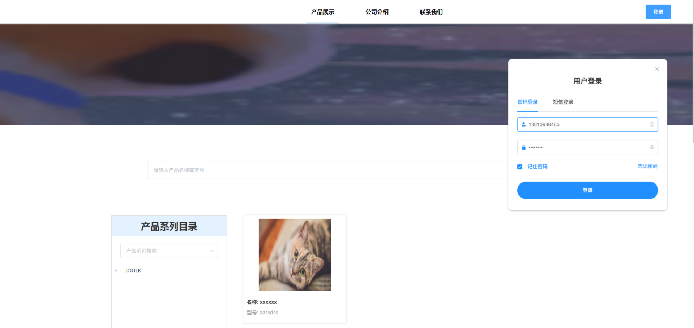
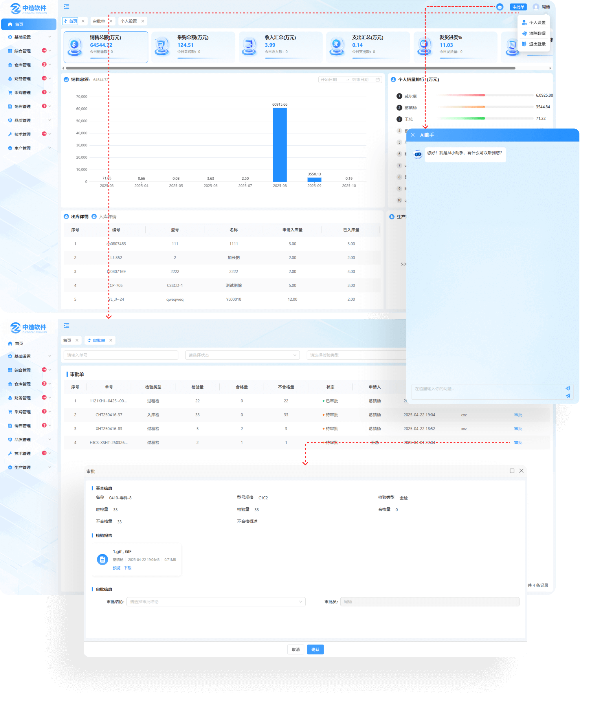

# 首页板块功能

#### 1、登录系统页面操作流程

* 密码登录
 
  -输入手机号和密码

* 短信登录

  -输入手机号发送验证码登录

#### 2.AI助手

  -点击右上角的第一个机器人图标，侧边将弹出AI助手弹窗，输入想要的内容，AI帮你协作完成

#### 3.审批单

* 品质管理的入库检验和成品检验中，不合格处理中选择“需审批”时，审批单中会显示需审批的单子

  -详情：点击详情按钮可查看基础信息和审批信息

  -审批：点击审批按钮，在弹窗中选中审批结论并提交即可

#### 4、进入系统鼠标悬浮在右上角名称上面显示 《个人设置》《清除数据》《退处登录》

* 个人设置分为 《个人信息》 《工作信息》 《设置》

* 在个人设置页面将显示，个人基础信息，工作信息

  -工作部门：指这个人所在的工作部门

  -工作岗位：指这个人所在的工作岗位

  -技术等级：指在综合部-员工档案列表中新增员工建档中所填写的

  -工作上级：指这个人的上一级

  -工作下级：指这个人的下一级

* 在下方设置中可进行头像上传和修改密码设置

* 当前用户权限为高级管理员时，暴露“清除数据”按键

  -点击清除数，选择开始时间（警告:您即将清除该企业的所有数据,此操作不可逆,数据删除无法恢复.请谨慎操作!）

* 退出登录

-点击退出登录即可退出登录

