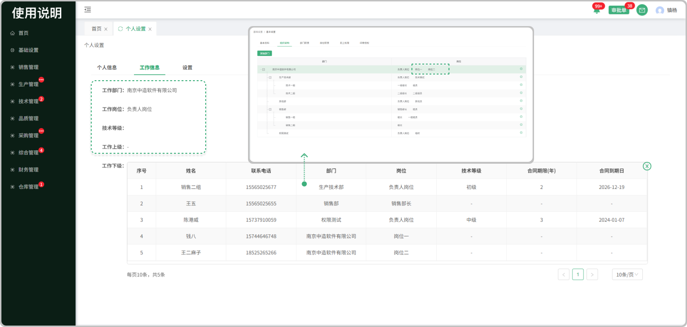
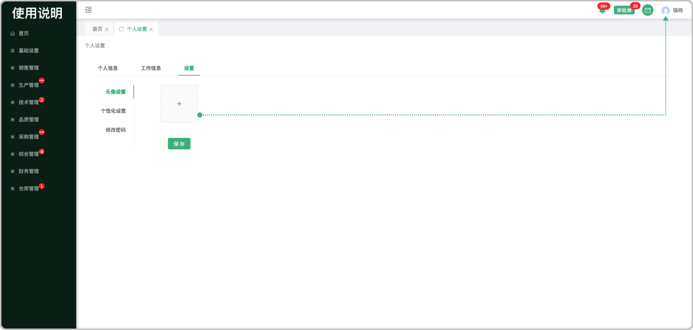
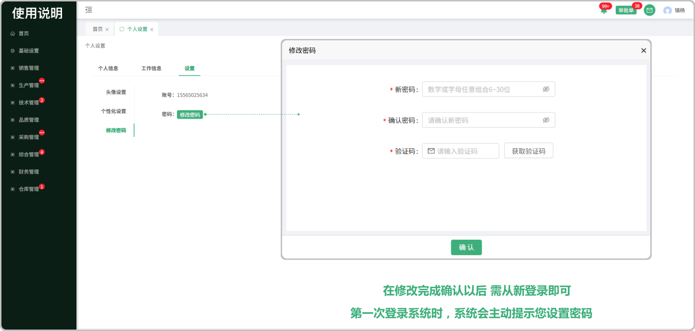
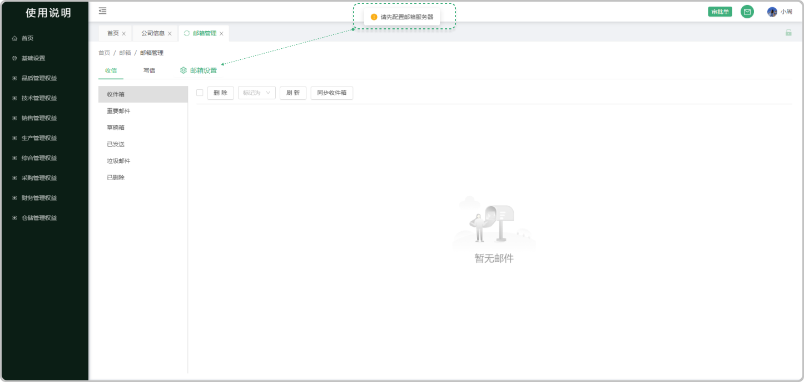

# 首页

> ###  一、登录系统页面操作流程

#### 1. 如图所示：点击系统登录页面

> ###  二、进入系统右上方第一个是个人账号设置分为《管理员设置》和《个人设置》以及《退出登录》

#### 2. 如图所示：管理员设置

 ##### 管理员分为《超级管理员》 《管理员》 《运营管理员》 可以新增《管理员》 《运营管理员》 前提是在基础设置人员信息中添加或者有人员信息的情况下新增，同时支持删除

#### 3. 如图所示：新增管理员

##### 个人设置分为 《个人信息》 《工作信息》 《设置》可以查看个人的信息展示 工作的信息内容 和系统的基础设置

#### 4. 如图所示：个人信息指的是个人的姓名、手机号、邮箱

#### 5. 如图所示：工作信息
* 工作部门：指这个人所在的工作部门（可在基础信息-部门与岗位中创建部门）
* 工作岗位：指这个人所在的工作岗位（可在基础信息-部门与岗位中添加或修改）
* 技术等级：指在综合部-员工档案列表中新增员工建档中所填写的
* 工作上级：指这个人的上一级（可在基础信息-部门与岗位中添加或修改）
* 工作下级：指这个人的下一级（可在基础信息-部门与岗位中添加或修改）

#### 6-8.如图所示：在设置中可以更换头像、个性化的一些设置、和修改密码

**头像设置**

**个性化设置**

**修改密码**

> ###  三、邮箱管理可以添加邮箱,在系统中发送信件和及时收到对方的信件

#### 9.如图所示:当点击 收信 和 写信 时会提示请先  配置邮箱服务器  因为还为添加邮箱,所以要去邮箱设置中配置邮箱服务器

#### 10.如图所示:在邮箱服务器配置中,选择邮件服务商,输入邮箱地址,授权码/密码，最后获取授权码（授权码有提示标识，可以查看到每一个邮箱获取授权码的操作流程

