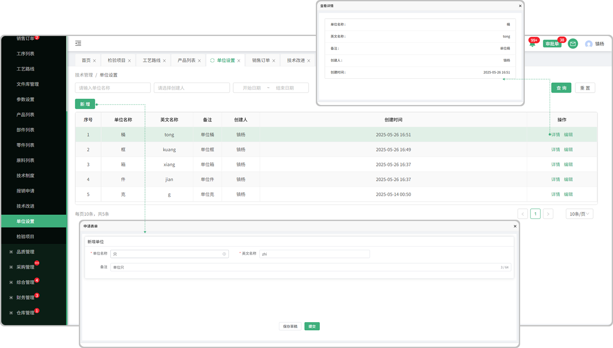

# 单位配置

> "单位配置"位于技术部板块，在"单位配置"中新增相对应的"标准单位" (在"产品列表新增产品"  " 零件列表新增零件" 等.....的时候用的到）
#### 1. 新增

* 点击新增按钮，输入单位名称，英文名称，备注即可

#### 2.编辑

* 可对新增过的单位进行修改

#### 详情

* 点击详情可查看所添加的单位名称，英文名称，备注信息，创建人，创建时间

