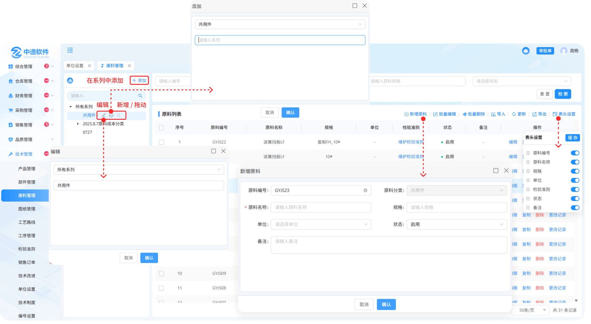
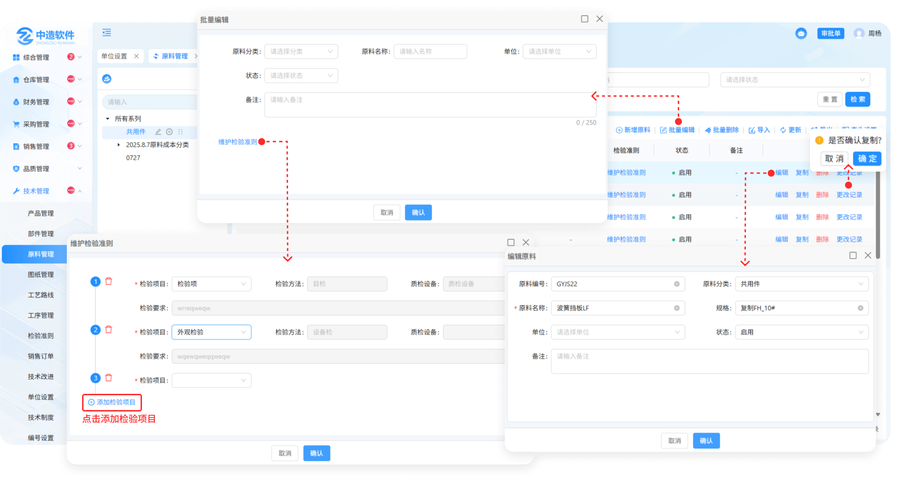
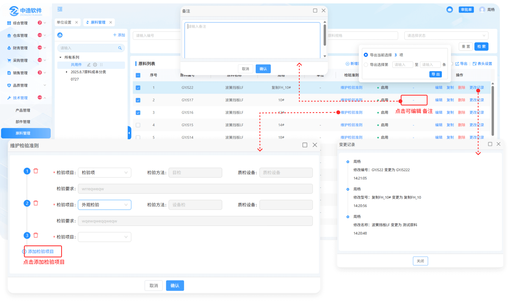
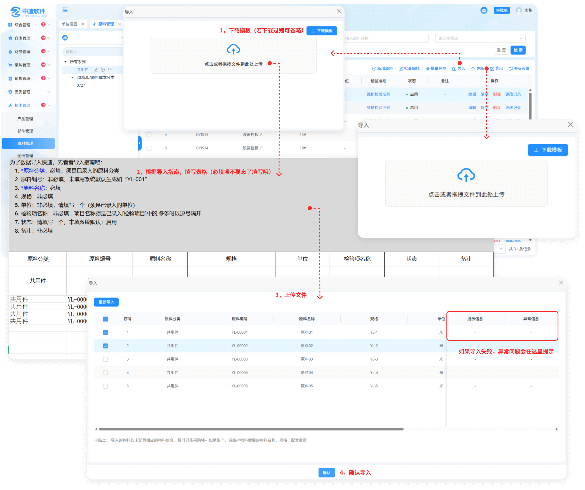

# 原料列表

> 原料列表位于技术管理板块，可添加原料系列、在系列中新增的原料支持，复制，编辑，删除 等操作.

#### 1.新增/编辑原料系列

* 默认显示所有系列，鼠标悬浮在系列上面可点击＋新增系列

  -新增的系列可再加子系列，子系列也可以往下面延申

  -如果该系列下有原料数据，就无法删除，没有数据的 可删除

  -新增的系列可编辑和拖拽调整位置

  -分类树支持拖拽调整宽度

#### 2.新增原料

* 点击新增原料按钮添加原料

  -在新增原料之前需选择对应的系列（放置的位置）

  -新增的原料名称/规格可以重复

  -如果在创建原料时状态选择了停用，那这个原料就不可用

#### 3.表头设置

* 点击表头设置图标可更改表头字段的显示/隐藏

#### 4.删除功能

* 需要删除时先在编辑中将状态改为停用才能删除
* 已经进行合同签章的原料不允许进行删除

#### 5.批量删除

* 勾选需要删除的内容，点击批量删除按钮即可删除

  -需要删除时先在编辑中将状态改为停用才能删除

  -有BOM的情况下是无法删除的，需要解除在进行删除

#### 6.编辑功能

* 可在原有新增的原料上进行编辑修改

#### 7.批量编辑

* 先勾选需要批量编辑的产品，点击批量编辑按钮即可进行编辑

  -点击可维护检验准则（支持添加多个检验项目）

#### 8.复制功能

* 可在这个原料的基础上去复制一个相同的零件出来，能够复制全部信息

#### 9.维护检验准则

* 添加检验项目（支持添加多个检验项目）

  -检验项目来源于检验项目列表

  -检验项目在品质部质检时起到重要关键

#### 10.更改记录

* 显示更改人，更改时间
* 会记录以下更改：原料编号修改，原料名称修改，原料规格修改，原料状态修改
  

#### 11.批量导出

* 点击导出按钮分为两种导出样式

  -先勾选需导出的内容，点击导出按钮选择第一个选项

  -点击导出按钮，选择第二个选项，手动输入导入1~N条

#### 12.备注

* 点击对应的备注字段添加备注

#### 13.更新

* 将导出的产品编辑完成后，点击更新按钮上传文件即可

#### 14.导入

* 点击批量导入，先下载模板（注意下载的模板只适用于批量导入原料里面上传的模板)

* 点开下载的模板进行编辑（编辑时请阅读表格上面的提示文案，以防导入时出现错误，从而无法导入）

  -模板中的检验项目名称就是技术部检验项目列表中所添加的检验项

* 点击或者拖拽所保存的模板（只有在原料的批量导入中下载的模板才能上传，其他无效）进行上传
* 上传成功会弹出显示上传的数据，可选择性导入或者一键导入（如果无法导入，请滑动到页面最后，查看提示信息，可能存在编辑时出现的错误，需从新更改再次上传）

