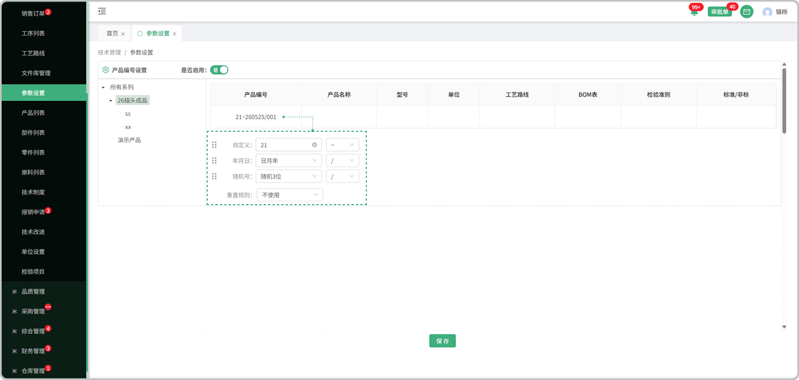

# 参数设置

> "参数设置"位于技术管理板块，可在参数设置中维护产品编号，部件编号，零件编号，原料编号，工艺路线号，工序号，文件编号

#### 1. 产品编号

* 是否启用：是代表使用，否代表不使用

* 预览：所设置的产品编号可在表头中预览

* 编号设置：分为自定义，年月日，随机号，同时可选择符号带入

* 重置规则：分为日，月，年，不使用，列：选择了日，就代表一日后重置，年就是一年，不使用就是永久

#### 2. 部件编号

* 是否启用：是代表使用，否代表不使用

* 预览：所设置的部件编号可在表头中预览

* 编号设置：分为自定义，年月日，随机号，同时可选择符号带入

* 重置规则：分为日，月，年，不使用，列：选择了日，就代表一日后重置，年就是一年，不使用就是永久

#### 3. 零件编号

* 是否启用：是代表使用，否代表不使用

* 预览：所设置的零件编号可在表头中预览

* 编号设置：分为自定义，年月日，随机号，同时可选择符号带入

* 重置规则：分为日，月，年，不使用，列：选择了日，就代表一日后重置，年就是一年，不使用就是永久

#### 4. 原料编号

* 是否启用：是代表使用，否代表不使用

* 预览：所设置的原料编号可在表头中预览

* 编号设置：分为自定义，年月日，随机号，同时可选择符号带入

* 重置规则：分为日，月，年，不使用，列：选择了日，就代表一日后重置，年就是一年，不使用就是永久

#### 5. 工艺路线号

* 是否启用：是代表使用，否代表不使用

* 预览：所设置的工艺路线号可在表头中预览

* 编号设置：分为自定义，年月日，随机号，同时可选择符号带入

* 重置规则：分为日，月，年，不使用，列：选择了日，就代表一日后重置，年就是一年，不使用就是永久

#### 6.工序号

* 是否启用：是代表使用，否代表不使用

* 预览：所设置的工序号可在表头中预览

* 编号设置：分为自定义，年月日，随机号，同时可选择符号带入

* 重置规则：分为日，月，年，不使用，列：选择了日，就代表一日后重置，年就是一年，不使用就是永久

#### 7.文件编号

* 是否启用：是代表使用，否代表不使用

* 预览：所设置的文件编号可在表头中预览

* 编号设置：分为自定义，年月日，随机号，同时可选择符号带入

* 重置规则：分为日，月，年，不使用，列：选择了日，就代表一日后重置，年就是一年，不使用就是永久

