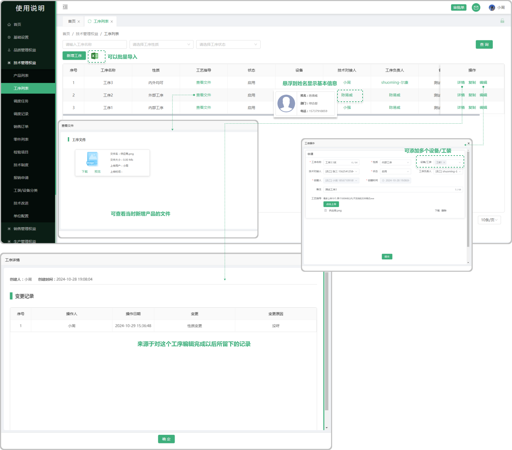
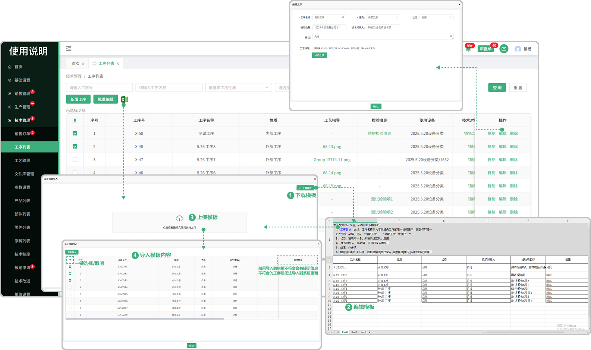

# 工序列表

> 工序列表位于技术管理板块，可新增相对应的工序用于创建工艺路线时使用
#### 1.新增工序
* 点击新增工序创建工序表单

* 可上传工艺指导文件（上传数量≤20份，单份文件大小≤50MB，暂不支持上传exe格式文件），上传的文件可删除，下载

#### 2.批量编辑
* 先勾选批量编辑的工序才能触发批量编辑按钮（默认置灰，只有勾选以后才提亮）
* 可一键选择/取消

#### 3.维护检验准则
* 点击维护检验准则可添加检验项目，支持添加多个检验项目，悬浮时提示删除图标，点击可删除对应的检验项目
* 选择的检验项目来源于技术部 “产品零件检验项目” 中添加的检验项目

#### 4.编辑
* 可编辑之前所添加的工序

#### 5.技术对接人
* 悬浮在人员名称上面可查看人员的基本信息（姓名、部门、电话）

#### 6.查看工艺指导
* 点击可查看新增工序时上传的工艺指导文件，支持下载、预览、下载pdf文件

#### 7.批量导入

* 点击批量导入，先下载模板（注意下载的模板只适用于批量导入工序里面上传的模板)

* 点开下载的模板进行编辑（编辑时请阅读表格上面的提示文案，以防导入时出现错误，从而无法导入）

  -工序批量导入支持质检项的导入，停用的质检项不会进行生成

* 点击或者拖拽所保存的模板（只有在工序的批量导入中下载的模板才能上传，其他无效）进行上传

* 上传成功会弹出显示上传的数据，可选择性导入或者一键导入（如果无法导入，请滑动到页面最后，查看提示信息，可能存在编辑时出现的错误，需从新更改再次上传）

