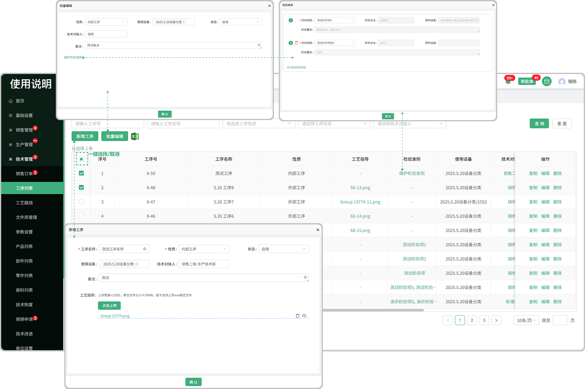

# 工序列表

> 工序列表位于技术部板块，在工序列表新增相对应的工序去产品列表新增工艺路线的时候可以选中在工序列表中添加的工序进行下一步的工艺路线创建
#### 1. 如图所示：
* 当前页面可以添加工序支持 ”复制“、“编辑”。
* 当鼠标悬浮在技术对接人、工序负责人字段时可查看负责人、对接人的基本信息（名称、部门、电话）。
* 点击可查看工艺指导的 “查看文件”可以查看文件，悬浮在文件上面可以下载此文件 (来源于新增工序所导入的文件)
* 批量导入，可以多个一次性导入到系统里面（详细教程在 "产品列表的图2中"有所介绍）

