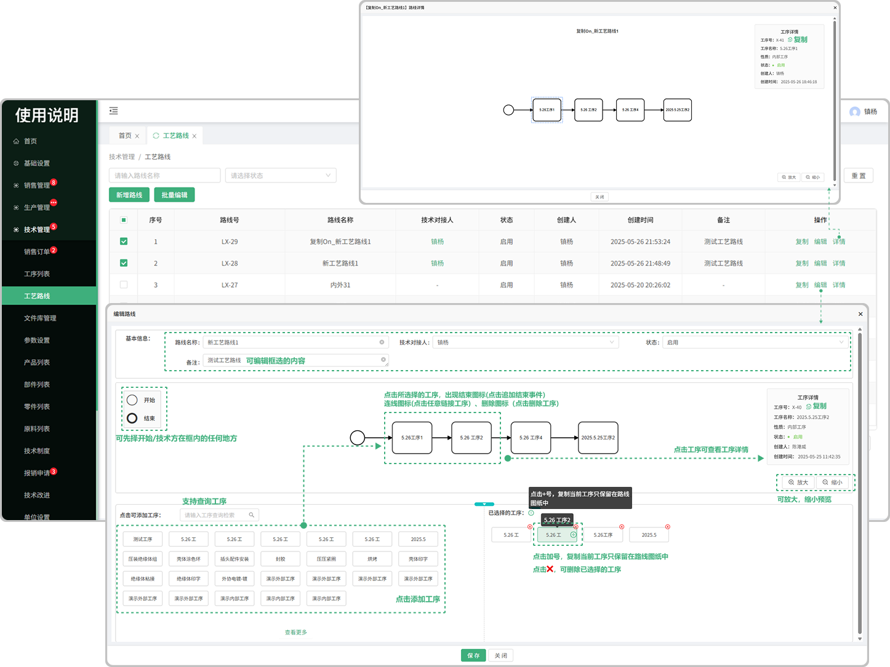

# 工艺路线列表

> 工业路线列表位于技术部板块，可新增工艺路线、编辑、复制

#### 1.新增工艺路线
* 在新增工艺路线时添加工序

  -点击工序可添加在路线中进行窜连

  -停用的工序不会显示在新增工艺路线添加工序中
* 开始/结束按钮（点击按钮可在工艺路线框内设置开始点和结束点，默认开始点在中间）
* 点击框内的工序出现结束图标(点击追加结束事件）、连线图标(点击任意链接工序）、删除图标（点击删除图标）
* 支持清空（点击清空删除框内所有的工序）、放大、缩小
* 可点击隐藏按钮隐藏添加的工序和已选择的工序
* 已选择的工序

  -鼠标悬浮在任意一个已选择的工序上面可复制工序（工序只保留在当前路线图纸中）

  -鼠标悬浮在任意一个已选择的工序上面点击❌可删除工序

* 生成路线

  -输入路线名称（必填）（不可重复）

  -选择技术对接人

  -选择状态（启用：工艺路线总状态变为启用状态，使用该工艺路线的产品和零件需要在详情中手动启用工艺才能够进行使用）（停用：把所有关于这条工艺路线状态全部改成停用，后续新增产品和零件也无法选择绑定此条路线。使用该工艺路线的产品和零件，详情界面的工艺路线变为停用状态）（用前使用该工艺路线已进行生产安排的产品零件，正常进行流程数据流转)

  -输入备注
  
 
 
#### 2.查看详情
* 可查看所编辑工艺路线的详细内容
* 可点击定位图标回到初始定位

#### 3.编辑
* 可编辑调整之前所新增的工艺路线

