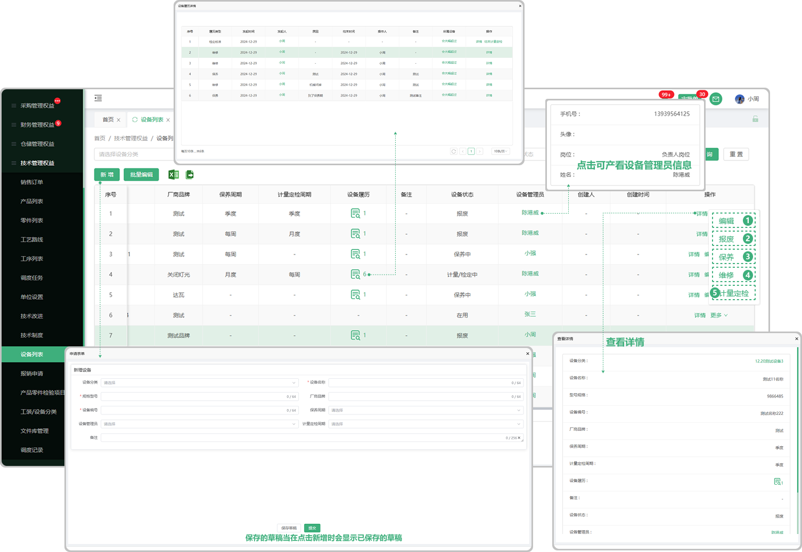
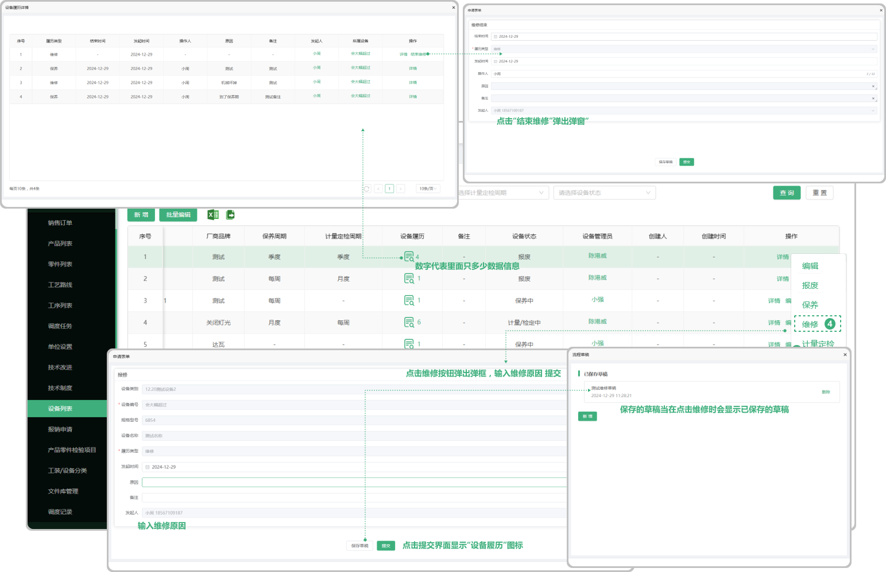

# 工装设备
> 工装设备 位于技术部板块，用于维护技术部使用的工装设备，包含、计量定检发起流程、设备保养发起流程、设备报修发起流程、设备报废发起流程

> 履历界面（工装设备二级页面）操作流程、设备报废流程、设备计量定检结束流程、设备定期保养结束流程、设备报修结束流程 (根据发起的设备维护类型，显示对应结束操作)

#### 1.批量编辑

* 点击批量编辑按钮勾选所编辑的按钮，可批量操作

#### 2.批量导出

* 点击导出按钮，勾选所要导出的数据，再次点击导出图标即可导出文件

#### 3.批量导入

* 1.点击批量导入，先下载模板（注意下载的模板只适用于批量导入工装设备里面上传的模板)
* 2.点开下载的模板进行编辑（编辑时请阅读表格上面的提示文案，以防导入时出现错误，从而无法导入）

  -设备类别就是工装/设备分类列表中添加的名称

* 3.点击或者拖拽所保存的模板（只有在工装设备列表的批量导入中下载的模板才能上传，其他无效）进行上传
* 4.上传成功会弹出显示上传的数据，可选择性导入或者一键导入（如果无法导入，请查看最后的提示信息，可能存在编辑时出现的错误，需从新更改再次上传）

#### 4.新增设备

* 设备名称、规格型号、设备编号是必选项

* 保存的草稿可在再次新增设备时显示

#### 5.设备履历

* 设备履历中记录了所填写的报废、保养、维修、计量检定信息，可点击结束报废、结束保养、结束维修、结束计量检定

#### 6.设备管理员

* 点击人员名称可查看这个人员的手机号、岗位

#### 7.详情

* 点击详情可查看这个工装设备的详细信息

#### 8.编辑功能

* 可编辑之前所增加的工装设备

#### 9.报废功能

* 报废完成以后报废的数据会带到设备履历中

  -报废以后页面只能编辑

* 在设备履历中可结束报废详情
  -设备履历图标旁边的数字代表里面有多少条数据

#### 10.保养

* 针对于这一个工设备的保养

* 保养完成以后可编辑或者报废、也可在设备履历中结束保养

* 在设备履历中可查看保养的数据（可结束保养）

#### 11.维修

* 针对于这一个工设备的维修

* 维修完成以后可编辑或者报废、也可在设备履历中结束维修

* 在设备履历中可查看维修的数据（可结束维修）

#### 12.计量定检

* 针对于这一个工设备的计量定检

* 计量定检完成以后可编辑或者报废、也可在设备履历中结束计量定检

* 在设备履历中可查看计量定检的数据（可结束计量定检）

