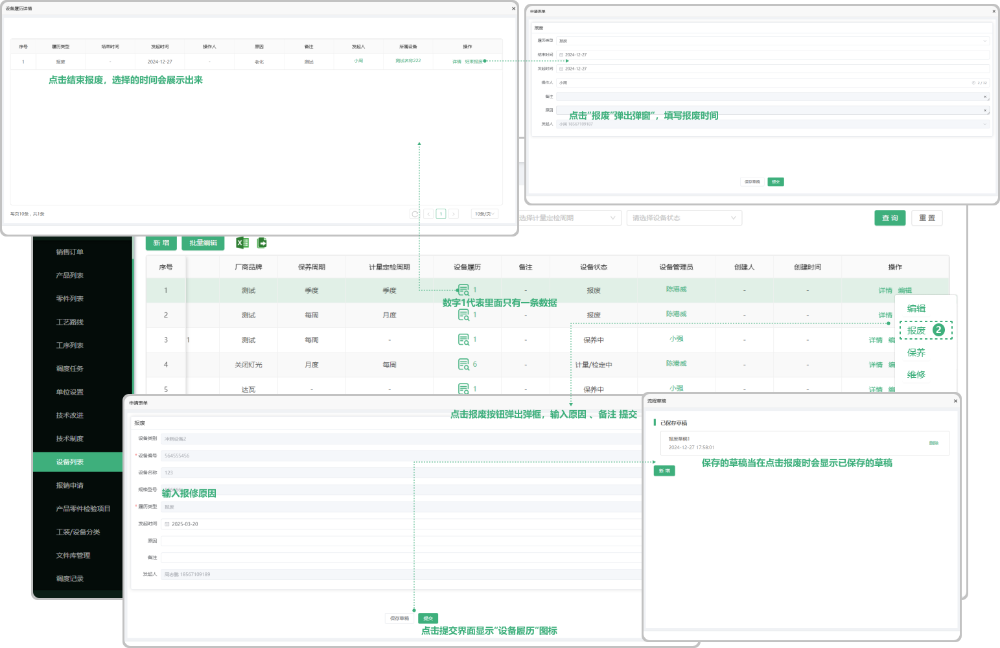
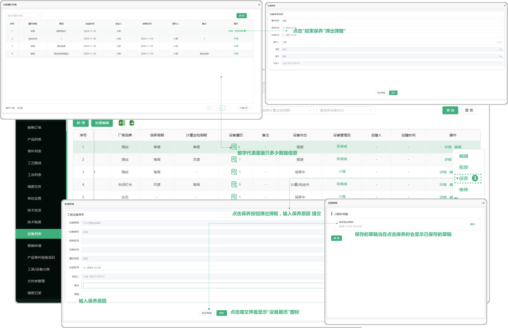

# 工装设备
> 工装设备 位于技术部板块，用于维护技术部使用的工装设备，包含、计量定检发起流程、设备保养发起流程、设备报修发起流程、设备报废发起流程

> 履历界面（工装设备二级页面）操作流程、设备报废流程、设备计量定检结束流程、设备定期保养结束流程、设备报修结束流程 (根据发起的设备维护类型，显示对应结束操作)

#### 1.新增工装设备

* 设备编号是必选项

* 保存的草稿可在再次新增工装设备时显示

#### 2.设备管理员

* 点击人员名称可查看这个人员的手机号、岗位

#### 3.详情

* 点击详情可查看这个工装设备的详细信息

#### 4.编辑功能

* 可编辑之前所增加的工装设备

#### 5.报废功能

* 报废完成以后报废的数据会带到设备履历中

  -报废以后页面只能编辑

* 在设备履历中可结束报废详情
  -设备履历图标旁边的数字代表里面有多少条数据

#### 6.保养

* 针对于这一个工设备的保养

* 保养完成以后可编辑或者报废、也可在设备履历中结束保养

* 在设备履历中可查看保养的数据（可结束保养）

#### 7.维修

* 针对于这一个工设备的维修

* 维修完成以后可编辑或者报废、也可在设备履历中结束维修

* 在设备履历中可查看维修的数据（可结束维修）

#### 8.计量定检

* 针对于这一个工设备的计量定检

* 计量定检完成以后可编辑或者报废、也可在设备履历中结束计量定检

* 在设备履历中可查看计量定检的数据（可结束计量定检）

