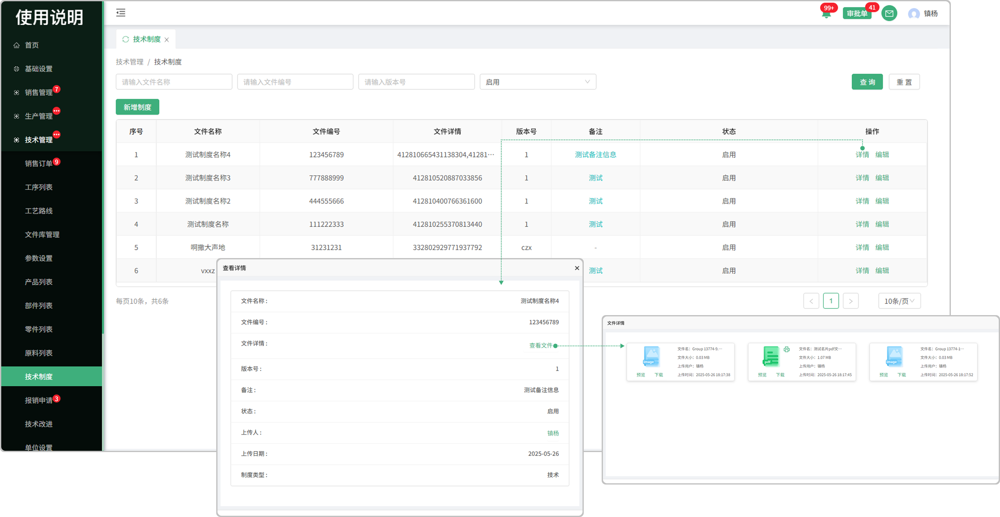

# 技术制度

> "技术制度"位于技术管理板块，在"技术制度列表"中新增相对应的"制度",是技术板块维护而指定的制度

#### 1.新增制度

* 点击新增 "技术制度"完成 "提交"以后 页面操作显示:详情  编辑

  -新增时可上传多个文件，上传的文件支持预览，删除，下载，提交后上传的文件可到文件详情中查看

* 如果保存草稿,在点击新增的时候会显示之前保存的草稿

#### 2.备注信息

* 点击备注信息可弹出弹窗查看全部

#### 3.详情

* 点击详情可查看，文件名称，文件编号，文件详情，版本号，备注，状态，上传人，上传日期，制度类型

* 点击文件详情的"查看文件"  可以查看上传的文件内容，支持预览，下载，pdf打印

#### 3.编辑

* 可对所新增的制度进行编辑修改

