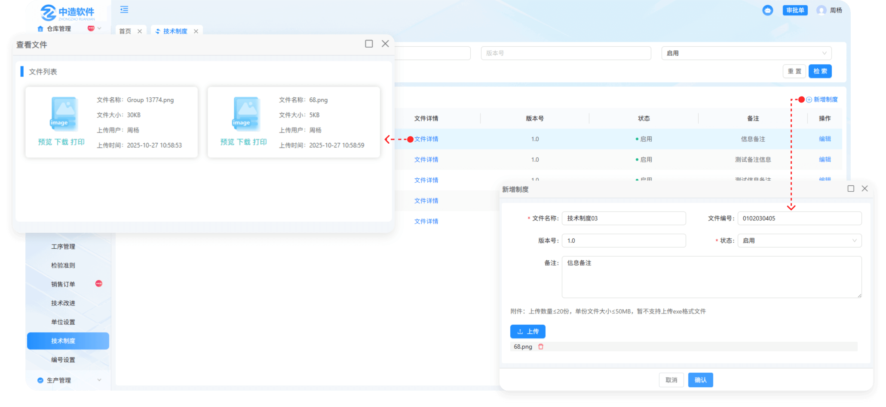

# 技术制度

> "技术制度"位于技术管理板块，在"技术制度列表"中新增相对应的"制度",是技术板块维护而指定的制度

#### 1.新增制度

* 点击新增 "技术制度"，填入相应信息数据"提交"以后，"技术制度"新增成功，可在数据列表中查看制度信息

  -新增时可上传多个文件，上传的文件支持预览、删除、下载，提交后上传的文件可到文件详情中查看
  

#### 2.编辑

* 可对所新增的制度进行编辑修改

#### 3.文件详情

* 点击“文件详情”可查看已上传文件信息，包括文件名、文件大小、上传用户、上传时间，可对其下载、预览

